## Forensics
---

## Apocalypse

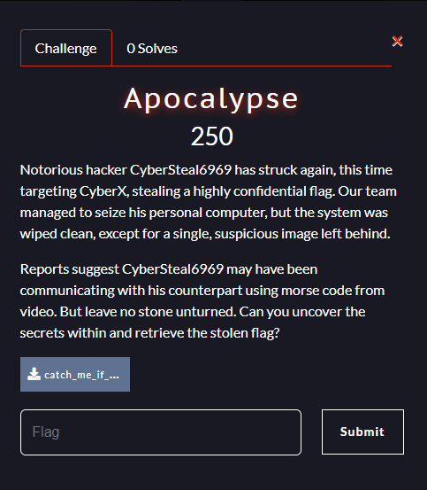  
### Description
Notorious hacker CyberSteal6969 has struck again, this time targeting CyberX, stealing a highly confidential flag. Our team managed to seize his personal computer, but the system was wiped clean, except for a single, suspicious image left behind.

Reports suggest CyberSteal6969 may have been communicating with his counterpart using morse code from video. But leave no stone unturned. Can you uncover the secrets within and retrieve the stolen flag?

---
#### Goals
1. Use pngchecker to check the status of the given image, obtained ERROR:"additional data after IEND chunk", which is after the cropped image
2. Use Acropalypse-Multi-Tool to recover the full image
   https://www.youtube.com/watch?v=R866SnJoKQg
3. Login to flickr with the credentials given
4. Try to find some useful informations across profile
5. Grab the pictures and analyse the metadata
6. Use wayback machine to track past version across the sites
---
#### Steps
1. pngchecker analyse the image  
   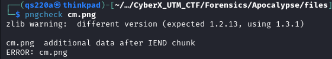  
2. Use the script to recover the full image
```
import zlib
import io
import struct
import tempfile
import os

class Acropalypse():
    def parse_png_chunk(self, stream):
        size = int.from_bytes(stream.read(4), "big")
        ctype = stream.read(4)
        body = stream.read(size)
        csum = int.from_bytes(stream.read(4), "big")
        assert(zlib.crc32(ctype + body) == csum)
        return ctype, body

    def pack_png_chunk(self, stream, name, body):
        stream.write(len(body).to_bytes(4, "big"))
        stream.write(name)
        stream.write(body)
        crc = zlib.crc32(body, zlib.crc32(name))
        stream.write(crc.to_bytes(4, "big"))
        
    def reconstruct_image(self, cropped_image_file, img_width, img_height, rgb_alpha):
        PNG_MAGIC = b"\x89PNG\r\n\x1a\n"

        orig_width = img_width
        orig_height = img_height

        with open(cropped_image_file, "rb") as f_in:
            magic = f_in.read(len(PNG_MAGIC))
            assert magic == PNG_MAGIC

            # find end of cropped PNG
            while True:
                ctype, body = self.parse_png_chunk(f_in)
                if ctype == b"IEND":
                    break

            # grab the trailing data
            trailer = f_in.read()
            
            print(f"Found {len(trailer)} trailing bytes!")

            # find the start of the next idat chunk
            try:
                next_idat = trailer.index(b"IDAT", 12)
            except ValueError:
                raise Exception("No trailing IDATs found!")

            # skip first 12 bytes in case they were part of a chunk boundary
            idat = trailer[12:next_idat-8] # last 8 bytes are crc32, next chunk len

            stream = io.BytesIO(trailer[next_idat-4:])

            while True:
                ctype, body = self.parse_png_chunk(stream)
                if ctype == b"IDAT":
                    idat += body
                elif ctype == b"IEND":
                    break
                else:
                    raise Exception("Unexpected chunk type: " + repr(ctype))

            idat = idat[:-4] # slice off the adler32

            print(f"Extracted {len(idat)} bytes of idat!")

            print("Building bitstream...")
            bitstream = []
            for byte in idat:
                for bit in range(8):
                    bitstream.append((byte >> bit) & 1)

            # add some padding so we don't lose any bits
            for _ in range(7):
                bitstream.append(0)

            print("Reconstructing bit-shifted bytestreams...")
            byte_offsets = []
            for i in range(8):
                shifted_bytestream = []
                for j in range(i, len(bitstream)-7, 8):
                    val = 0
                    for k in range(8):
                        val |= bitstream[j+k] << k
                    shifted_bytestream.append(val)
                byte_offsets.append(bytes(shifted_bytestream))

            # bit wrangling sanity checks
            assert(byte_offsets[0] == idat)
            assert(byte_offsets[1] != idat)

            print("Scanning for viable parses...")

            # prefix the stream with 32k bytes so backrefs can work
            prefix_length = 0x8000
            prefix = b"\x00" + (prefix_length).to_bytes(2, "little") + (prefix_length ^ 0xffff).to_bytes(2, "little") + b"\x00" * prefix_length

            for i in range(len(idat)):
                truncated = byte_offsets[i%8][i//8:]

                # only bother looking if it's (maybe) the start of a non-final adaptive huffman coded block
                if truncated[0]&7 != 0b100:
                    continue

                d = zlib.decompressobj(wbits=-15)
                try:
                    decompressed = d.decompress(prefix+truncated) + d.flush(zlib.Z_FINISH)
                    decompressed = decompressed[prefix_length:] # remove leading padding
                    if d.eof and d.unused_data in [b"", b"\x00"]: # there might be a null byte if we added too many padding bits
                        print(f"Found viable parse at bit offset {i}!")
                        # XXX: maybe there could be false positives and we should keep looking?
                        break
                    else:
                        print(f"Parsed until the end of a zlib stream, but there was still {len(d.unused_data)} bytes of remaining data. Skipping.")
                except zlib.error as e: # this will happen almost every time
                    pass
            else:
                print("Failed to find viable parse!")
                raise Exception("Failed to find viable parse!")

            print("Generating output PNG...")

            output_path = os.path.join(tempfile.gettempdir(), 'restored.png')
            with open(output_path, "wb") as out:
                out.write(PNG_MAGIC)

                ihdr = b""
                ihdr += orig_width.to_bytes(4, "big")
                ihdr += orig_height.to_bytes(4, "big")
                ihdr += (8).to_bytes(1, "big") # bitdepth
                if rgb_alpha:
                    ihdr += (6).to_bytes(1, "big") # true colour with alpha
                else:
                    ihdr += (2).to_bytes(1, "big") # true colour
                ihdr += (0).to_bytes(1, "big") # compression method
                ihdr += (0).to_bytes(1, "big") # filter method
                ihdr += (0).to_bytes(1, "big") # interlace method

                self.pack_png_chunk(out, b"IHDR", ihdr)

                # fill missing data with solid magenta
                if rgb_alpha:
                    reconstructed_idat = bytearray((b"\x00" + b"\xff\x00\xff\xff" * orig_width) * orig_height)
                else:
                    reconstructed_idat = bytearray((b"\x00" + b"\xff\x00\xff" * orig_width) * orig_height)

                # paste in the data we decompressed
                reconstructed_idat[-len(decompressed):] = decompressed

                self.pack_png_chunk(out, b"IDAT", zlib.compress(reconstructed_idat))
                self.pack_png_chunk(out, b"IEND", b"")

            print("Done!")
            return output_path

# Create an instance of the Acropalypse class
acropalypse = Acropalypse()

# Reconstruct the image using the correct resolution of 1920x1080
output_image_path = acropalypse.reconstruct_image('cm.png', 1920, 1080, True) // change to your input image file name

```
References: https://youtu.be/R866SnJoKQg?si=rby5gJoYa2s9zR4N

3. Retrieve the recovered full image from the specified output directory: /tmp folder
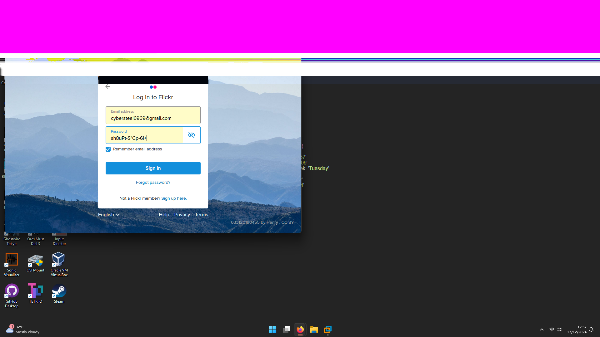  
4. Login to flickr with the credentials obtained from the recovered image  
```
cybersteal6969@gmail.com
sh8UPt-S"Cp-6i+
```
   
5. Browse through cybersteal6969's profile, we found two videos, flag1 and flag2  
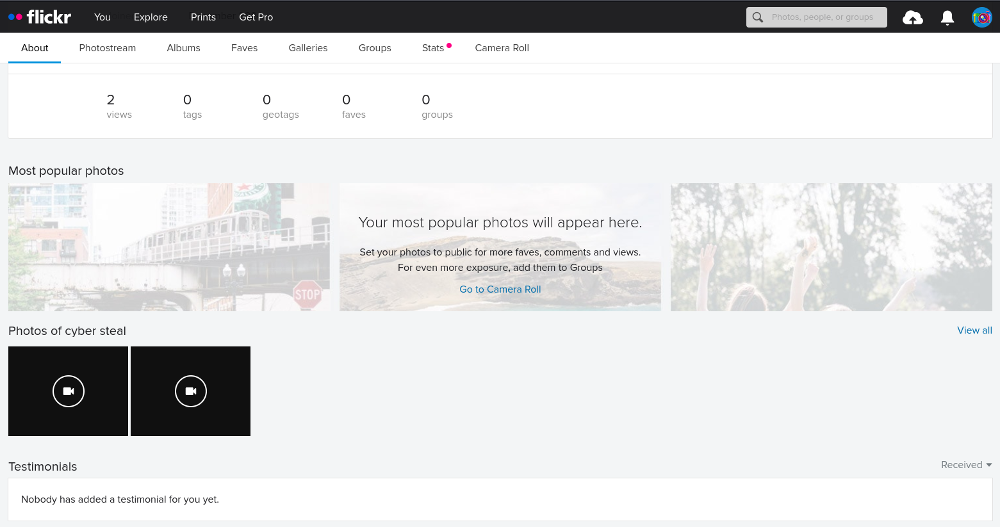  
6. From the video, we analyse the morse code, given "NO FLAG FOR YOU TRY SOMETHING ELSE"
Morse Code Analyser: https://morsecode.world/international/decoder/audio-decoder-adaptive.html
7. From the videos, we know that, it was posted by info stealer6969, shared to cybersteal6969, two of them are communicating  
   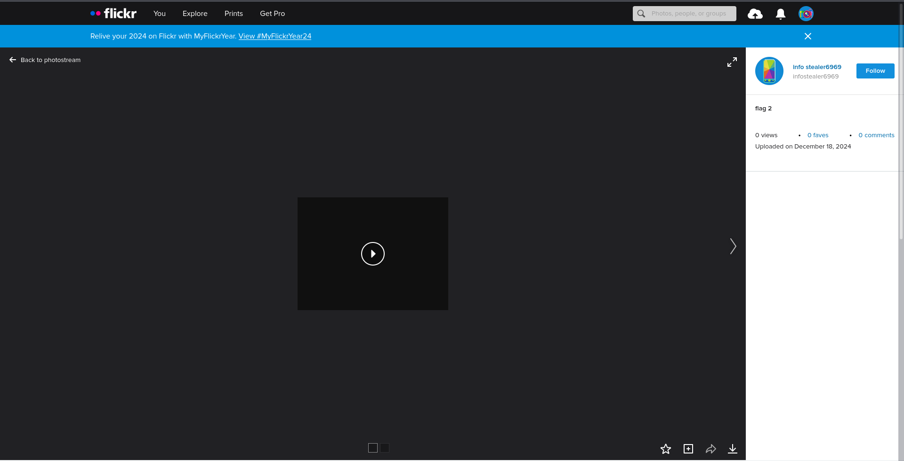  
8. Enter info stealer6969 profile, we found another video, named flag, analyse the morse code, we get "GOODJOBG3TT1NGH3R3", this is the first decoy flag  
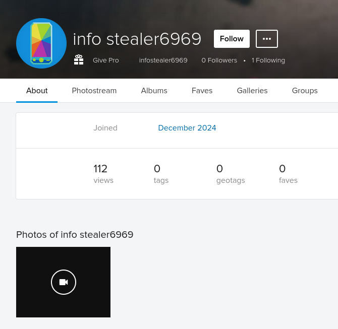  
9. Keep browsing, we found that info stealer6969 uploaded bunch of pictures  
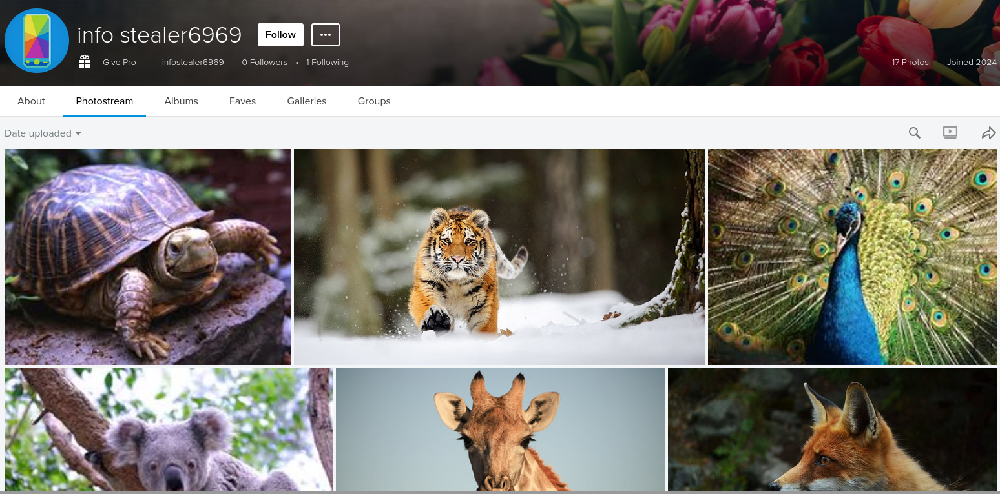  
10. These pictures containing secret info in their metadata
11. Using exiftool, we found that cat.jpg directs us to https://cyberxstupid.blogspot.com/2024/12/blog-post.html, shown at comment section  
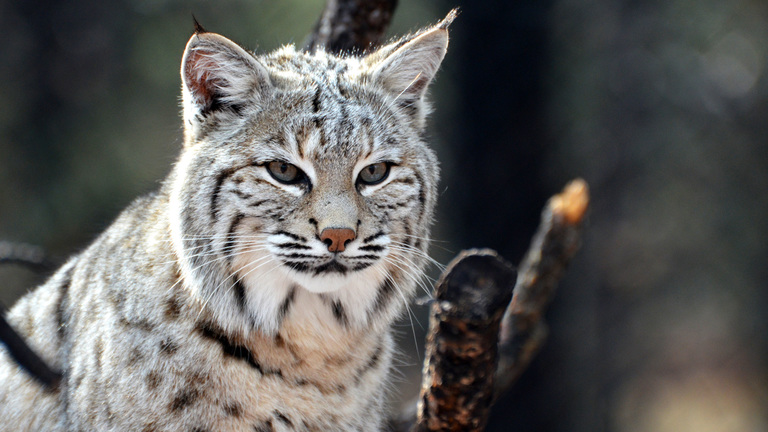  
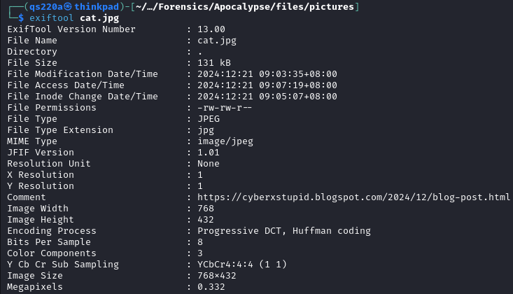  
12. Randomly clicking through the site, we found the second decoy flag CyberX{c4t_m0us3_g4m3_34sy}  
  
13. Here we need to use Wayback Mahcine, archive.org, to track the past version of the site.  
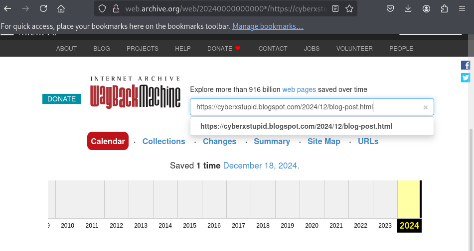  
14. Under the same link but in past version, we obtain the final flag CyberX{c4t_m0us3_pl4y_m4d3_34s13r}  
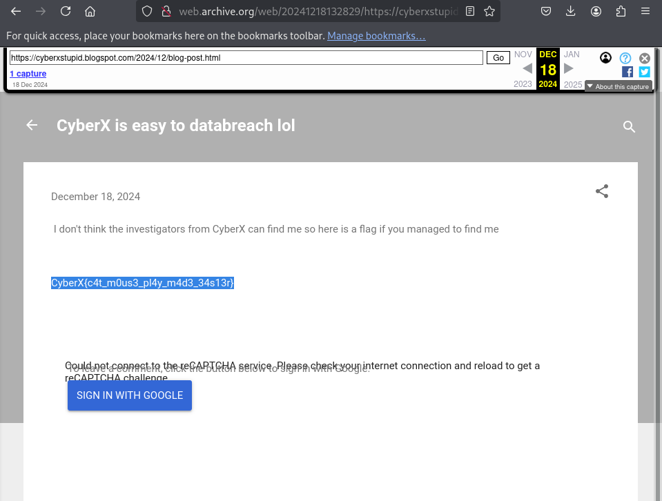