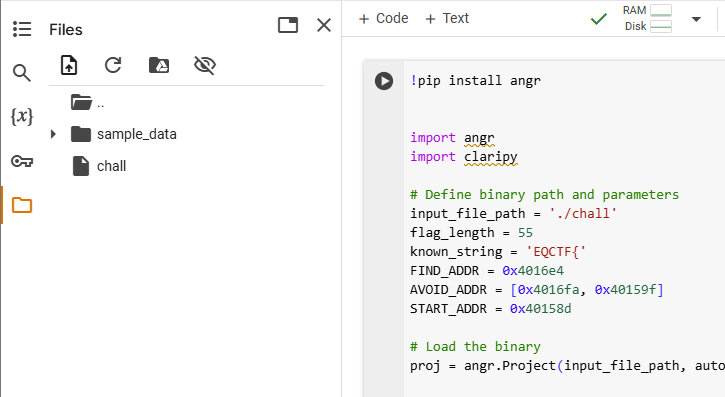
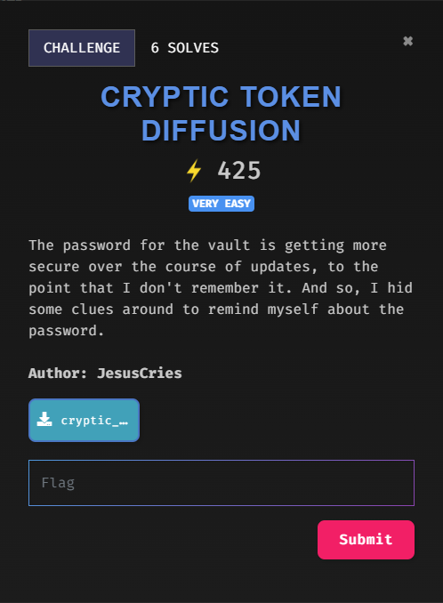
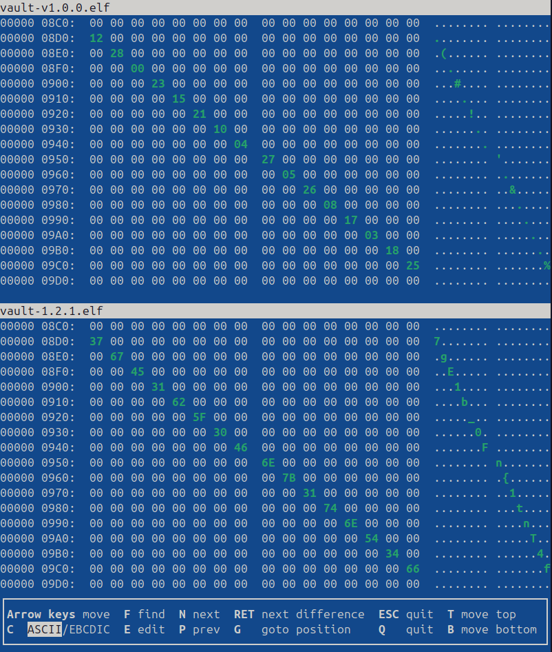

## Reverse Engineering
---
## Baka Mitai
 
---
### Goals
1. Check file information using checksec
2. Decompilation using ghidra, check the flagchecker flow
3. Deploy angr script, perform symbolic analysis
_References:_
https://shinmao.github.io/posts/2022/02/bp1/
https://github.com/jakespringer/angr_ctf
---
1. Using checksec, we realised the file is dynamcally linked, stripped
 
2. Decompile with ghidra, since it's stripped, we have to find the main entry from entry function
 
3. Try to rename the variables, functions, for ease of analysis
 
From this point, we could know that:
- The program proceed if flag length == 0x37 (55 characters), 
- It go through complex transformation, lastly doing flagcheck and tell if the flag provide from user input is correct
- Well, we are not going to reverse and go through these complex transformations.
- Instead, we will deploy angr script, automate this process

4. I deployed the angr script on google colab
 
```python
!pip install angr

import angr
import claripy
  
# Define binary path and parameters
input_file_path = './chall'
flag_length = 55
known_string = 'EQCTF{'
FIND_ADDR = 0x4016e4
AVOID_ADDR = [0x4016fa, 0x40159f]
START_ADDR = 0x40158d

# Load the binary
proj = angr.Project(input_file_path, auto_load_libs=False, main_opts={'base_addr': 0x400000})
  
# Create symbolic characters for the flag
known_chars = [claripy.BVV((known_string[i])) for i in range(len(known_string))]
flag_chars = [claripy.BVS(f"flag_{i}", 8) for i in range(flag_length - len(known_string))]
flag = claripy.Concat(*known_chars + flag_chars)

# Create a blank state at the start address
state = proj.factory.blank_state(addr=START_ADDR)
state.options.add(angr.options.LAZY_SOLVES)
state.options.add(angr.options.UNICORN)
  
# Define the address of the local variable `local_58` (e.g., `[RBP - 0x50]`)
# Assume RBP is initialized to some stack base (common for blank_state)
stack_base = state.regs.rbp
local_58_address = stack_base - 0x50  # Offset to local variable `local_58`
  
# Store the symbolic flag into `local_58`
state.memory.store(local_58_address, flag)

# Pass the address of `local_58` in RDI (used by __isoc23_scanf)
state.regs.rdi = local_58_address

# Add constraints to ensure flag is printable (ASCII range 0x20 to 0x7e)
for k in flag_chars:
    state.solver.add(k < 0x7f)  # Less than 0x7f (127)
    state.solver.add(k > 0x20)  # Greater than 0x20 (32)

# Create a simulation manager
sim_manager = proj.factory.simulation_manager(state)

# Explore paths to find the target address while avoiding bad paths
sim_manager.explore(find=FIND_ADDR, avoid=AVOID_ADDR)

# Check if a solution was found
if len(sim_manager.found) > 0:
    # Evaluate the symbolic flag to retrieve its value
    solution = sim_manager.found[0].solver.eval(flag, cast_to=bytes)
    print(f"Flag found: {solution.decode()}")
else:
    print("No solution found.")
```
To understand how this script works in details, do check out the references provided, and follow the tutorials.
The scripting is hard, it just follow a strict template.
However, there are few points worth mentioning, 
- the start_addr, should be placed after scanf CALL instruction, better if placed at where complex transformation start
- symbolic stack approach is an important point, specifically for this challenge where you can't just use a universal angr template
- blank_state should be used instead of entry_state because strlen is called before scanf, if you define the sim manager with entry state, it will waste extra resources going through strlen library call. Within all libc library call, there are mutex locks which angr cant deal with, which is why you need to hook the function and simulate user input with symbolic memory
- find_addr, is the desired memory location where the instance of "Correct" is reached
- avoid_addr are the memory location to avoid such as "Wrong"

### Final Result
---
 


## Cryptic Token Diffusion
 
---
### Goals
1. Perform binary diffing
2. Match index number to correspond characters
3. Rearrange the character in ascending order according to their index number
_Tools required: vbindiff_
---
1. Viewing the files, there are two versions of application. Thus, we try to compare the difference between versions.
 
```bash
vbindiff vault-v1.0.0.elf vault-1.2.1.elf
```

2. Observe the pattern, we realised that there are two parts showing difference in binaries:
    - vault-v1.0.0 acts as the index number, corresponds to the characters in vault-v1.2.1
_Part 1_
 
_Part 2_
 
- List out all the correspondence, sort them in ascending order, turn to ASCII and print it out
```python
v1p1 = [12, 28, 0, 23, 15, 21, 10, 4, 27, 5, 26, 8, 17, 3, 18, 25]
v1p2 = [9, 13, 7, 24, 6, 2, 1, 11, 14, 22, 29, 16, 19, 20]

v2p1 = [0x37, 0x67, 0x45, 0x31, 0x62, 0x5f, 0x30, 0x46, 0x6e, 0x7b, 0x31, 0x74, 0x6e, 0x54, 0x34, 0x66]
v2p2 = [0x72, 0x30, 0x6E, 0x66, 0x31, 0x43, 0x51, 0x5F, 0x5F, 0x64, 0x7D, 0x31, 0x72, 0x79]

v1 = v1p1 + v1p2
v2 = v2p1 + v2p2

pairs = sorted(zip(v1, v2))

sorted_ascii = ''.join(chr(value) for _, value in pairs)

print(sorted_ascii)
```
### Final Result
---
 


## Gen Z
  
 
---
### Goals
1. Deobfuscate the C code, you may choose not to as it just work
2. Observe the log, figure out how the flag might relate to the timestamp
---
1. Opening the file, you will see obfuscated C code
```cpp
#define rn ;
#define finna =
#define cap !=
#define mf *
#define bouta &
#define ongod ++
#define sheesh <
#define fr <<
#define bet if
#define chief main
#define yikes break
#define deadass return
#define skibidi {
#define tho }
#define bussin cout
#define huh true
#define lit double

#include <iostream>
#include <fstream>
#include <iomanip>
#include <openssl/sha.h>


using namespace std rn

unsigned int seed() skibidi
    deadass static_cast<unsigned int>(time(nullptr)) rn
tho

string getHash(lit value) skibidi
    ostringstream oss rn
    oss fr setprecision(17) fr value rn
    string text finna oss.str() rn
    unsigned char hash[SHA256_DIGEST_LENGTH] rn
    SHA256(reinterpret_cast<const unsigned char mf>(text.c_str()), text.size(), hash) rn
    ostringstream result rn
    for (int i finna 0 rn i sheesh SHA256_DIGEST_LENGTH rn i ongod) {
        result fr hex fr setw(2) fr setfill('0') fr static_cast<int>(hash[i]) rn
    tho
    deadass result.str() rn
tho


int chief() skibidi
    while (huh) skibidi
        unsigned int s finna seed() rn
        srand(s) rn
        int x finna rand() rn

        string flag finna getHash(x) rn

        bet (flag.find("a9ba358e") cap string::npos) {  
            ofstream outfile("./flag") rn
            bet (outfile.is_open()) {
                outfile fr "EQCTF{" fr flag fr "tho" rn
                outfile.close() rn
            tho
            yikes rn
        tho
  
        time_t now finna time(0) rn
        tm mf ltm finna localtime(bouta now) rn


        bussin fr "[" fr 1900 + ltm->tm_year fr "-" rn
        bussin fr 1 + ltm->tm_mon fr "-" rn
        bussin fr ltm->tm_mday fr "] " rn
        bussin fr "🤓☝️ erm actually, you're incorrect 🥺👉👈: " fr x fr endl rn
    tho
    bussin fr "Good job Skibidisigma 🐺🥶 - Adolf Rizzler 🗿" fr endl rn

    deadass 0 rn
tho
```
Just replace the obfuscated part with its actual symbol as shown in define list, to ease our debugging process.

2. After debobfuscation,
```cpp
#include <iostream>
#include <fstream>
#include <iomanip>
#include <openssl/sha.h>
  
using namespace std;
  
unsigned int seed()
{
    return static_cast<unsigned int>(time(nullptr));
}

string getHash(double value)
{
    ostringstream oss;
    oss << setprecision(17) << value;
    string text = oss.str();
  
    unsigned char hash[SHA256_DIGEST_LENGTH];
    SHA256(reinterpret_cast<const unsigned char *>(text.c_str()), text.size(), hash);

    ostringstream result;
    for (int i = 0; i < SHA256_DIGEST_LENGTH; i++)
    {
        result << hex << setw(2) << setfill('0') << static_cast<int>(hash[i]);
    }
    return result.str();
}


int main()
{
    while (true)
    {
        unsigned int s = seed();
        srand(s);
        int x = rand();

        string flag = getHash(x);

        if (flag.find("a9ba358e") != string::npos)
        {
            ofstream outfile("./flag");
            if (outfile.is_open())
            {
                outfile << "EQCTF{" << flag << "}";
                outfile.close();
            }
            break;
        }

        time_t now = time(0);
        tm *ltm = localtime(&now);
  
        cout << "[" << 1900 + ltm->tm_year << "-";
        cout << 1 + ltm->tm_mon << "-";
        cout << ltm->tm_mday << "] ";
        cout << "🤓☝️ erm actually, you're incorrect 🥺👉👈: " << x << endl;
    }
    cout << "Good job Skibidisigma 🐺🥶 - Adolf Rizzler 🗿" << x << endl;

    return 0;
}
```

3. Observing the logfile, 
 
We should focus that flag is paired up on \[2025-01-01], so we should patch our c code to run on that time stamp, and which we just need to fix the seed() function
Part that affect:
```cpp
unsigned int s = seed();
srand(s);
int x = rand();
```
Patched seed() function:
```cpp
// Brute-force timestamp around 2025-01-01
unsigned int seed() {
    static time_t test_time = 1735689600;  // 2025-01-01 00:00:00 UTC
    if (test_time <= 1735775999) {  // 2025-01-01 23:59:59 UTC
        return static_cast<unsigned int>(test_time++);
    }
    return static_cast<unsigned int>(time(nullptr)); // Fallback to current time
}
// -------------------------------------------
// You may also add the line for Found correct seed: to indicate that you found correct seed
if (flag.find("a9ba358e") != string::npos) { 
    ofstream outfile("./flag"); 
    if (outfile.is_open()) { 
        outfile << "EQCTF{" << flag << "}"; 
        outfile.close(); } 
        cout << "Found correct seed: " << s << endl; 
        break; 
    }
...
...
```

4. Due to the usage of openssl/sha.h, we should compile our C++ file as below
```bash
g++ -o gen_z chall.cpp -lssl -lcrypto
```
5. Execute the file
```bash
./gen_z
```

### Final result
---
 
And flag file is generated:
 