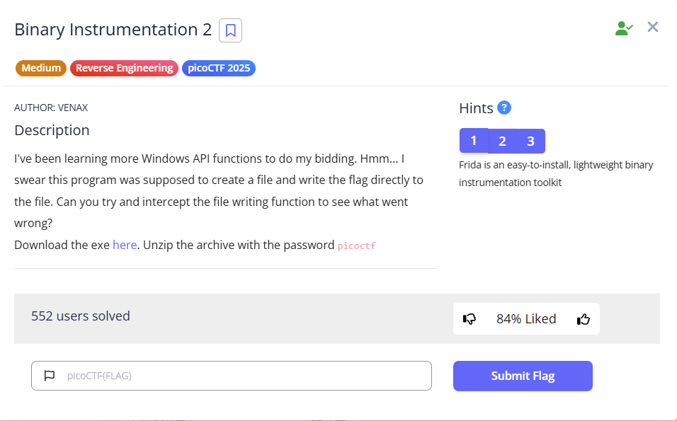
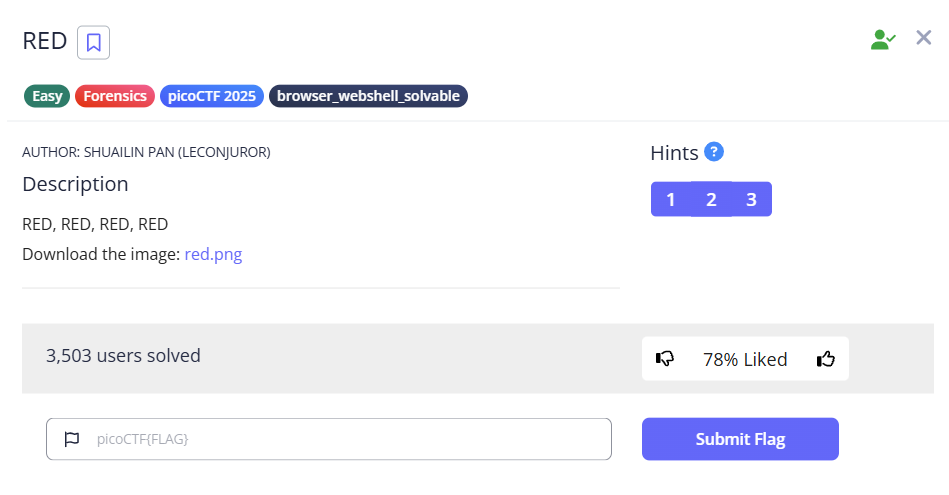
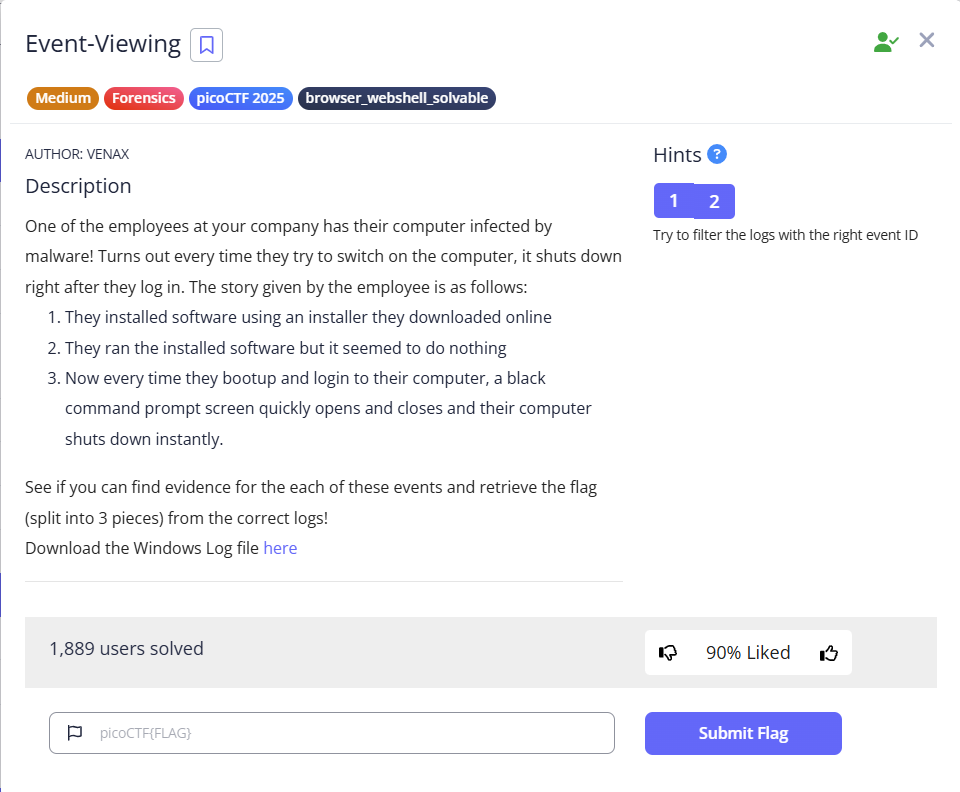
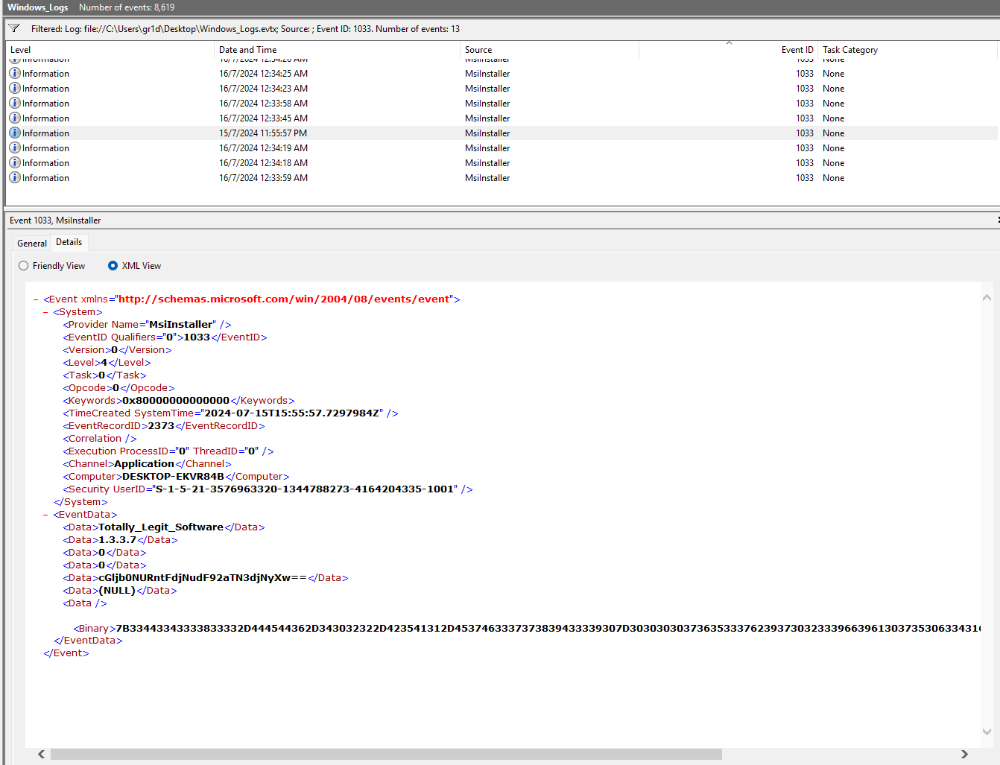
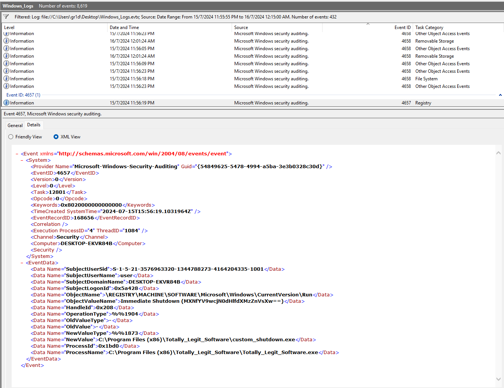
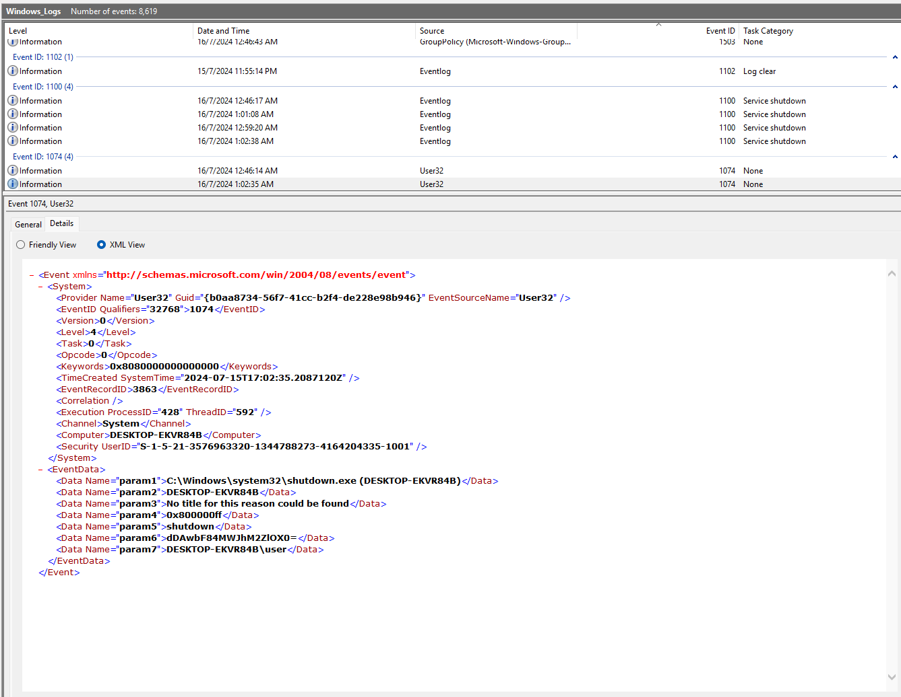
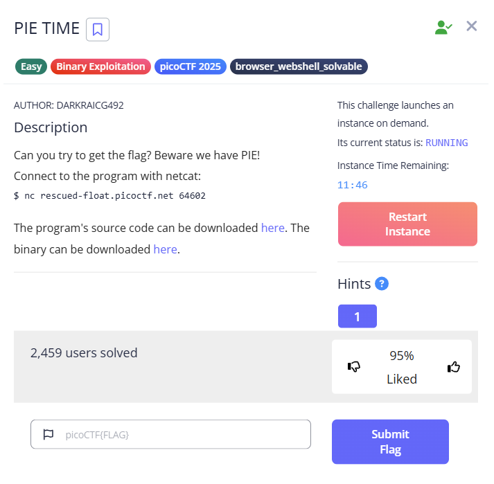
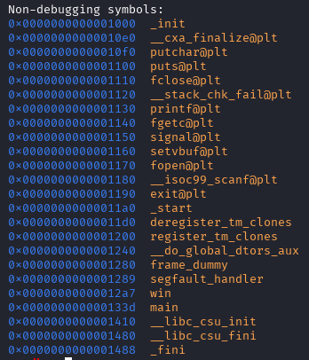

## [Reverse Engineering]

## Flag Hunters  
  
---
### Goals
When the program starts, the lip is set to the line [VERSE], to retrieve the secret_intro, we need to alter the program so the lip variable set to the line of flag
```
Pico warriors rising, puzzles laid bare,
Solving each challenge with precision and flair.
With unity and skill, flags we deliver,
The ether’s ours to conquer, '''\
+ flag + '\n'
```
as shown, flag is at line 4

so passing index 0 to 3 will works, printing at the start of the lines at most line 4, index 3

**Payload:** `<any_text>;RETURN <0 to 3>   (This is not injection)`
### Final Result
---
**Flag:** `picoCTF{70637h3r_f0r3v3r_c659e814}`


## Quantum Scrambler  
  
---
### Goals
1. Decrypt the encryption and retrieve the flag
2. Dissect the elements, and observe the scramble
3. Found final payload, decrypt with reversed scrambler
---
### Solution
Reversed scrambler:
```python
import ast

def flatten(lst):
    flat = []
    for item in lst:
        if isinstance(item, list):
            flat.extend(flatten(item))
        else:
            flat.append(item)
    return flat

def unscramble(cypher):
    print("Outer list elements:")
    for index, element in enumerate(cypher):
        print(f"Element {index}: {element}")
    print("-" * 40)
    
    flat_list = flatten(cypher)
    
    hex_strings = [s for s in flat_list if isinstance(s, str) and s.startswith("0x")]
    
    flag_chars = [chr(int(h, 16)) for h in hex_strings]
    flag = ''.join(flag_chars)
    return flag

def main():
    input_file = 'output.txt'
    
    try:
        with open(input_file, 'r') as f:
            cipher_text = f.read()
    except Exception as e:
        print(f"Error reading file {input_file}: {e}")
        return
    
    try:
        cypher = ast.literal_eval(cipher_text)
    except Exception as e:
        print("Error interpreting cipher text:", e)
        return
    
    flag = unscramble(cypher)
    print("Recovered flag:", flag)

if __name__ == '__main__':
    main()
``` 
**Final payload:** `[['0x70'],['0x69'],['0x63'],['0x6f'],['0x43'],['0x54'],['0x46'],['0x7b'],['0x70'],['0x79'],['0x74'],['0x68'],['0x6f'],['0x6e'],['0x5f'],['0x69'],['0x73'],['0x5f'],['0x77'],['0x65'],['0x69'],['0x72'],['0x64'],['0x65'],['0x66'],['0x38'],['0x65'],['0x61'],['0x30'],['0x63'],['0x66'],['0x7d']]`  
_Save this as output.txt_

### Final Result
---
**Flag:** `picoCTF{python_is_weirdef8ea0cf}`


## Binary Instrumentation 1  
  
---
### Goals
1. The binary bininst1.exe calls the `Sleep` function from kernel32.dll
2. Using frida-trace, we generate the handler scripts for API functions
3. Intercept any call to `Sleep`, in this case, under `KERNEL32.dll`
4. We then set sleep duration to 0, avoiding the program from sleeping.
---
### Solution
1. Using frida-trace
```bash
frida-trace -i "Sleep" ./bininst1.exe
```

2. Intercept the handler, by modifying the handler generated, changing sleep duration to zero.
```js
// KERNEL32.DLL/Sleep.js
var sleepAddr = Module.getExportByName("kernel32.dll", "Sleep");
Interceptor.attach(sleepAddr, {
    onEnter: function (args) {
        // Log the original sleep duration (for debugging)
        console.log("Original sleep time: " + args[0].toInt32());
        // Change the sleep duration to 0
        args[0] = ptr(0);
    }
});
```
### Final Result
---
**Flag:** `picoCTF{r3d_1s_th3_ult1m4t3_cur3_f0r_54dn355_}`


## Binary Instrumentation 2  
  
---
### Goals
1. Disassemble with ghidra, look for suspicious function
2. Hook with frida
---
### Solution
1. Deploy the script that hook suspicious function at `0x1dc0`
```js
// Get the module base address for bininst2.exe
var moduleBase = Module.findBaseAddress("bininst2.exe");
console.log("Module base address: " + moduleBase);

// Calculate the target function address using a known offset (update this offset as needed)
var funOffset = 0x1dc0; // Adjust this based on your analysis
var targetFunction = moduleBase.add(funOffset);
console.log("Hooking function at: " + targetFunction);

// Hook the target function (FUN_140001dc0)
Interceptor.attach(targetFunction, {
    onEnter: function(args) {
        // Assume:
        //   args[0] is a pointer to the flag data
        //   args[1] is the length of the flag data
        var length = args[1].toInt32();
        try {
            // Try to read the flag data as a UTF-8 string
            var flagData = Memory.readUtf8String(args[0], length);
            console.log("Flag data intercepted (utf8): " + flagData);
        } catch (err) {
            console.log("Error reading flag data as UTF-8: " + err);
            // If reading as a string fails, dump the raw bytes
            console.log("Flag data intercepted (raw):\n" + hexdump(args[0], { length: length, header: true, ansi: false }));
        }
    },
    onLeave: function(retval) {
        console.log("FUN_140001dc0 returned: " + retval);
    }
});
```
2. Run the script, then find for the flag
```bash
frida -l <script>.js -f ./bininst2.exe
```

### Final Result
---
Base64 Encoded Flag:  
  
**Flag:** `picoCTF{fr1da_f0r_b1n_in5trum3nt4tion!_b21aef39}`


## [Forensics]

## RED  
  
---
### Goals
1. Steganography, just upload to Aperi'Solve, ez flag
---
### Solution

   

### Final Result
---
**Flag:** `picoCTF{r3d_1s_th3_ult1m4t3_cur3_f0r_54dn355_}`


## flags are stepic  
  
---
### Goals
1. Find the country that doesn't exist, the flag persists
2. Download the country flag
3. Search for stepic tool  
        - https://shankaraman.wordpress.com/tag/ctf/  
        - https://code.tools/man/1/stepic/  
        - https://pypi.org/project/stepic/  
4. Install stepic tool through pip
5. Unhide the flag
---
### Solution

  

### Final Result
---
**Flag:** `picoCTF{fl4g_h45_fl4g57f48d94}`


## Ph4nt0m 1ntrud3r  
  
---
### Goals
1. Sort the time, since the reference times are messed up
2. Decode flag encoded in base64 in a series of consecutive packets
---
### Solution

  

### Final Result
---
**Flag:** `picoCTF{1t_w4snt_th4t_34sy_tbh_4r_e5e8c78d}`


## Event-Viewing  

---
### Goals
1. Lookup 1033 Event, msi package install event id
2. Filter with date and time, look for suspicious event after 1033 happen within a short time range, about 20 minutes, found
3. "EVERY TIME" <---(from question), so clear date and time filter, find with keyword "shutdown.exe" throughout whole event log
---
### Solution

Part 1:  
  
**Base64:** `cGljb0NURntFdjNudF92aTN3djNyXw==`
**Flag 1:** `picoCTF{Ev3nt_vi3wv3r_`

Part 2:  

**Base64:** `MXNfYV9wcjN0dHlfdXMzZnVsXw==`
**Flag 2:** `1s_a_pr3tty_us3ful_`

Part 3:  
  
**Base64:** `dDAwbF84MWJhM2ZlOX0=`
**Flag 3:** `t00l_81ba3fe9}`


### Final Result
---
**Flag:** `picoCTF{Ev3nt_vi3wv3r_1s_a_pr3tty_us3ful_t00l_81ba3fe9}`


## [Binary Exploitation]

## PIE TIME  

---
### Goals
1. Call the win() function
---
### Solution

1. Disassemble with gdb  
  

2. Observe the difference in address between main function and win function
The difference is 0x96, thus, to call the function's address, it must always be `main()` - `0x96`

### Final Result
---
Launch the challenge  
  
**Flag:** `picoCTF{b4s1c_p051t10n_1nd3p3nd3nc3_a267144a}`


## [General Skills]

## YaraRules0x100  
  
---
### Goals
1. To detect malware sample with YARA rule while avoiding false positives and false negatives.
2. Malware can exist in packed(obfuscated) or unpacked(fully extracted in memory), the rule should cover both version.
---
### Solution

```
rule suspacked
{
    strings:
        $packed_div = ".text$div"

    condition:
        all of them
}

rule susunpacked
{
    strings:
        $unpacked_xml = "<?xml version='1.0' encoding='UTF-8' standalone='yes'?>"
        $unpacked_dll = "ADVAPI32.dll"

    condition:
        all of them
}
```  
1. Search for yara rule, follow the hint given, work with the format:
https://yara.readthedocs.io/en/stable/writingrules.html
2. Open file with ghidra, search for strings, do trial and error
### Final Result
---
**Flag:** `picoCTF{yara_rul35_r0ckzzz_74c37bd8}`
