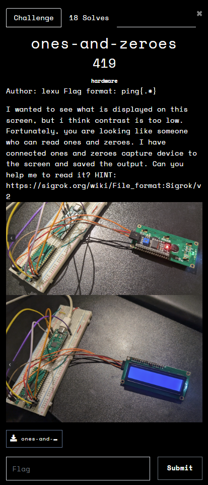
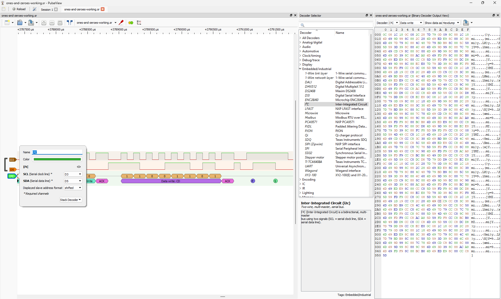
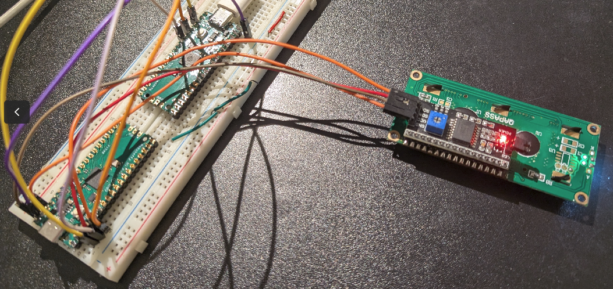
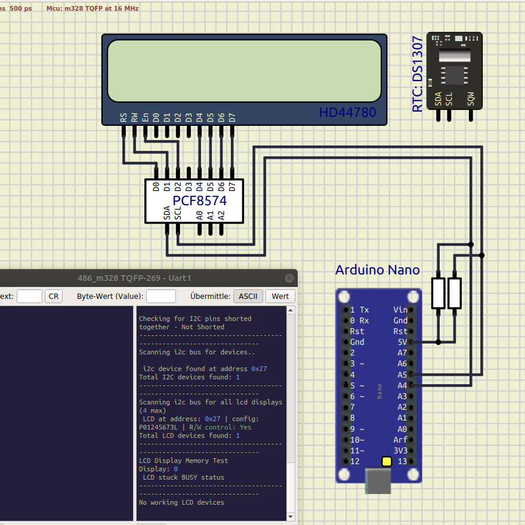
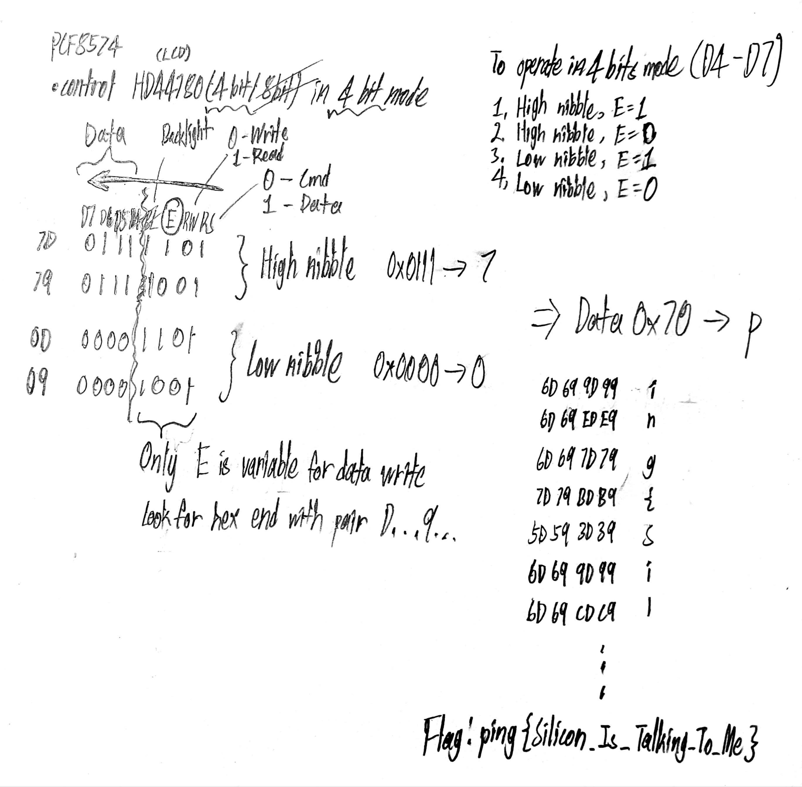

## Misc

## ones-and-zeroes  

---
### Goals
1. Download PulseView to decode the I2C signal
2. Identify the SDA and SCL, decode the signal, focus on DATA WRITE hexdump.  

3. Research on connection between I2C port, how it communicate with LCD pane.
4. From LCD pane datasheet, decode the message.
https://cdn.sparkfun.com/assets/9/5/f/7/b/HD44780.pdf
---

### Solution
1. Identify the pinouts and we realise that the focus is only on I2C outputs SDA and SCL, at the end passing to HD44780 LCD Pane, so we don't bother anything on breadboard.
   
  

2. Since we are the LED controller is PCF8574, we are going to operate HD44780 on 4-bit data mode.  
To retrieve a single ASCII Hex character, it work on High nibble and Low nibble.  
As in hexdump instruction, it exist like this:  
         - High nibble, E(Enable)= 1  
         - High nibble, E(Enable) = 0  
         - Low nibble, E(Enable) = 1   
         - Low nibble, E(Enable) = 0  

3. Dissect the High Nibble and Low Nibble binaries, combine them into single series, decode it into ascii characters.  

4. Solution overview  
  

### Final Result
**Flag:** `pingCTF{Silicon_Is_Talking_To_Me}`