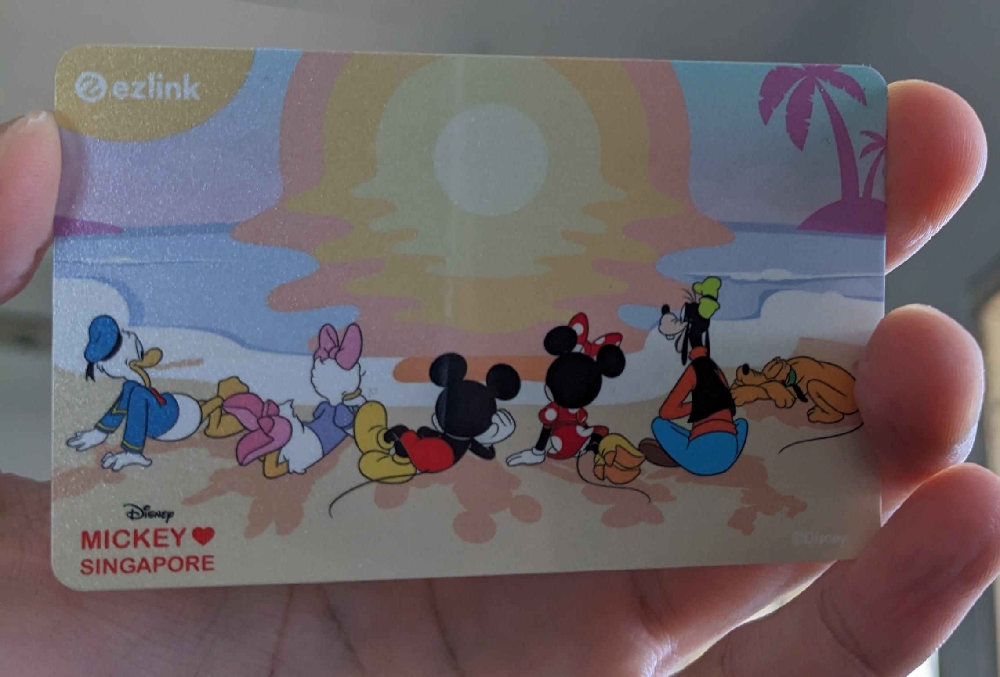

Attending **SinCon 2025** was a valuable experience, filled with learning opportunities, networking, and interesting challenges at "kampungs". This blog will provide a rundown of the event.

## The Journey to SinCon

The **UTM curfew** (12 AM to 6 AM) meant I had to start my journey at a specific time. I took the **P211 bus** from UTM to Larkin around 9 PM, followed by the **P101** to JB Central. Fortunately, both of these bus rides were **free of charge**.

Before crossing the border, I took care of a couple of essentials: activating an **international data roaming plan** (RM30) and reporting my stay in Singapore via the **MyICA app**, which is linked to my passport.

From JB Central, I walked to the CIQ. After a passport scan, and then another, I proceeded to choose a bus. As my destination was Queen St, I boarded the **CW2**. Being my first time crossing the border without an **EZLink card**, I used my debit card for the bus fare. A quick wave of the card at JB CIQ, and I was on my way.

The ride from JB CIQ to **Woodlands Checkpoint** was approximately 5 minutes. It was not necessary to tap out with the debit card when arriving there. I scanned my passport at Woodlands, then re-boarded the **CW2** (tapping my debit card again). The bus then continued to **Queen St Terminal**. Again, no tap-out was required upon arrival.

   

I spent my first night in Singapore at a **McDonald's** near Queen St Terminal, thanks to their **complimentary Wi-Fi**. There, I had an iced latte and configured my virtual machines and other necessary software for the upcoming SinCon workshops.
  

Early of the next morning, I went to the nearest MRT station by Queen St and purchased an **EZLink card**. The cost was **10 SGD** (5 SGD for the card itself and 5 SGD in stored credit).  
  

## SinCon Day 1: Workshops and First Impressions

Upon arrival at **Voco Orchard**, the SinCon venue,

At registration desk, I received my pass and some conference souvenirs. Breakfast was provided, which was a welcome addition. Following that, we attended **two keynote sessions**.

  

Around 11 AM, as workshops were still being set up, I visited the **AI Kampung**. The moderator presented an impressive demonstration of using **Copilot with Gemini 2.5 and Augment** for rapid application development.

  

The demonstration highlighted how these tools could significantly impact the development of **red and blue team tools** in cybersecurity, bringing an evolution to the industry.

My first workshop was **Shellshock**, which proved to be quite insightful.
*   For more details, refer to:  
https://gr1d-init.github.io/blog/sinconshellshock/

In between sessions, I visited the **Electronic Badge Kampung** and had my **Dragon Badge** soldered. It looked impressive.
  

After lunch, I attended the **Windbg workshop**. This session provided a solid introduction to the **dynamic analysis of Windows binaries**.
  
*   Further information can be found here:  
https://gr1d-init.github.io/blog/sinconwindbg/

This concluded the first day of the conference.

## Evening Activities and CTF Engagement

I traveled by bus to my accommodation, using my new **EZLink card** for payment. That evening, feeling quite overwhelmed, I nevertheless dedicated some time to the **Dragon Badge CTF challenges**.
  

  

*   My writeups for these challenges are available at:  
https://gr1d-init.github.io/blog/sincondragonbadge/

## SinCon Day 2: Hardware Hacking and Discoveries

The following morning, I returned to **Voco Orchard** for the second day of SinCon. After breakfast, I immersed myself in what became my favorite part of the conference: the **Hardware Hacking Kampung**, hosted by the **bi0sctf team**. Their team members were approachable, willing to teach, and I gained significant insights into hardware hacking. It was, in my opinion, the most engaging kampung.
  

I also participated in their **hardware CTF** and was pleased to win a **CompatrIoT board**. Look how sophisticated it is.
  
*   My writeup for this CTF:  
https://gr1d-init.github.io/blog/sinconhardwarekampung/

After the hardware CTF, I visited the **RFID Kampung**. There, I received an introduction to **BadUSB** (casually referred to as "bad mouse") and other RFID-related topics.
  
*   More information on this can be found at:  
https://gr1d-init.github.io/blog/sinconrfidkampung/

I also stopped by the **Cyber Range Village**, which featured **pentest-style Active Directory CTFs**. 
  
I joined their community at `rangevillage.org` and discovered additional CTFs on `playtrv.async.sg`. Unfortunately, due to time constraints, I was unable to attend their AD workshop, but it is an area I intend to explore further.

And with that, **SinCon 2025 concluded**.

## AfterCon: Exploring Singapore

With the conference finished, I took some time for sightseeing. I headed to **Marina Bay** and saw the **Marina Bay Sands**. I also had a view of the **Merlion statue** across the water. My visit included **Gardens by the Bay**, where I saw the iconic **Supertree Grove**.
  

It was then time to begin my journey back. I took the **CW2 bus** from Queen St Terminal. This time, scanning my EZLink card produced a **yellow ticket**.
  

The return journey mirrored my arrival: **Woodlands Checkpoint** (passport scan), re-boarded **CW2**, reached **JB CIQ** (another passport scan), then another **CW2** ride to Larkin. From Larkin, the free **P211 bus** transported me back to UTM, concluding my trip safely.

## Overall Experience and Reflections

Beyond the formal workshops and talks, SinCon provided an excellent opportunity to connect with fellow **cybersecurity enthusiasts** and join new communities. It was a highly positive experience overall, with the **hardware hacking session** led by the **bi0sctf team** being a particular highlight.

## Acknowledgements

I extend my sincere gratitude to **InfoSec in the City** for selecting me for the **SinCon 2025 student scholarship**. I also offer massive thanks to the **bi0sctf team** for their hardware hacking session, all the **speakers** for their insightful workshops, the **event crews** for their hard work in ensuring the event ran smoothly, and **everyone I had the pleasure of meeting**. I learned a great deal from these interactions.

## Budget Breakdown (Approximate)

Here is an estimated breakdown of my expenses. All SGD amounts have been converted to MYR using an approximate exchange rate of **1 SGD ≈ 3.29 MYR** (based on rate from xe.com, May 27, 2025).

| Item                                      | Cost (SGD) | Cost (MYR) |
| :---------------------------------------- | :---------: | :---------: |
| Accommodation                             |     -      |   130.00   |
| International Data Roaming                |     -      |    30.00   |
| EZLink Card Purchase (Fee)                |    5.00    |    16.46   |
| EZLink Card Purchase (Initial Credit)     |    5.00    |    16.46   |
| Transport (Singapore - EZLink top-ups)    |   10.00    |    32.92   |
| Transport (Malaysia - buses)              |     -      |     4.80   |
| Food & Drinks (McDonald's Iced Latte)     |    1.00    |     3.29   |
| **Total**                                 |  **21.00** |  **233.93** |

In summary, it was an **enriching and insightful trip**. I look forward to future adventures among the communities.
