SinCon 2025's hardware badge reimagines Singapore's iconic Dragon Playground as an interactive CTF challenge. This nostalgic tribute to the Dragon Playground at Toa Payoh, Singapore.
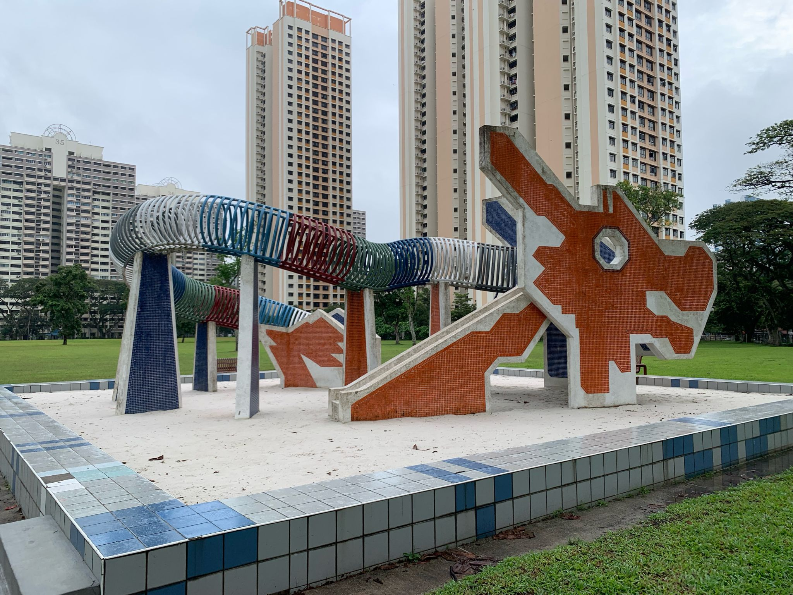

## Getting Started

### Badge Assembly

First, you'll need to solder the badge with 8 LEDs. Follow the comprehensive assembly guide:
- 📄 [Assembly Guide](./assets/sincon-dragon-solder.pdf)

### Environment Setup

Once your badge is assembled, set up the CTF environment:
- 📄 [CTF Setup Guide](./assets/sincon-dragon-ctf.pdf)

## Challenge Writeups

### Challenge 1

**Question:**
```
baaba abaaa abbab aaaba abbba abbab
aaabb baaab aaaaa aabba abbba abbab
```

**Solution:**

This is a Bacon cipher. The pattern uses two different characters (represented by 'a' and 'b') to encode letters.

Decoding the cipher gives us: `SINCONDRAGON`

Since the flag format requires all lowercase.

The flag is: **sincondragon**

---

### Challenge 2

**Question:**
```
That's one beautiful lanyard, innit?
```

**Solution:**

The challenge references a physical lanyard with runic symbols. Using Google Lens to scan the symbols reveals they correspond to RUNE fonts.

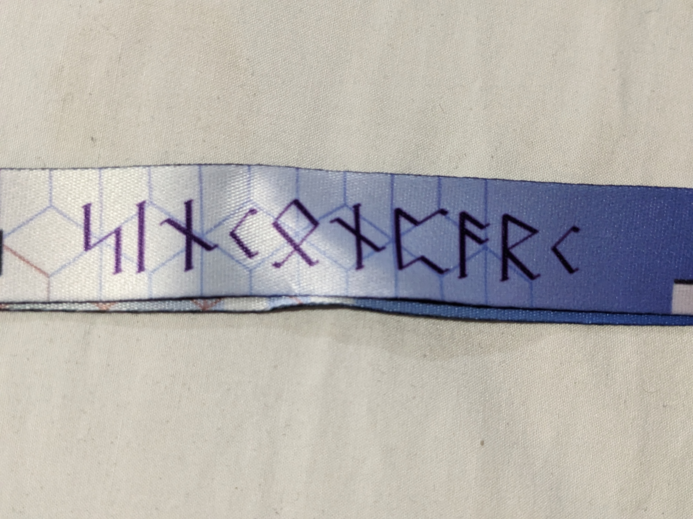

By decoding each runic character individually and converting to lowercase as required by the flag format.

The flag is: **sinconparc**

---

### Challenge 3

**Question:**
```
aGFja2Vyd2FyZS5pby9zaW5jb24yMDI1LWNoYWxsZW5nZS1h
```

**Solution:**

First, decode the Base64 string to reveal a website URL:
```
https://hackerware.io/sincon2025-challenge-a
```

Visiting the website reveals two split pieces of a QR code:

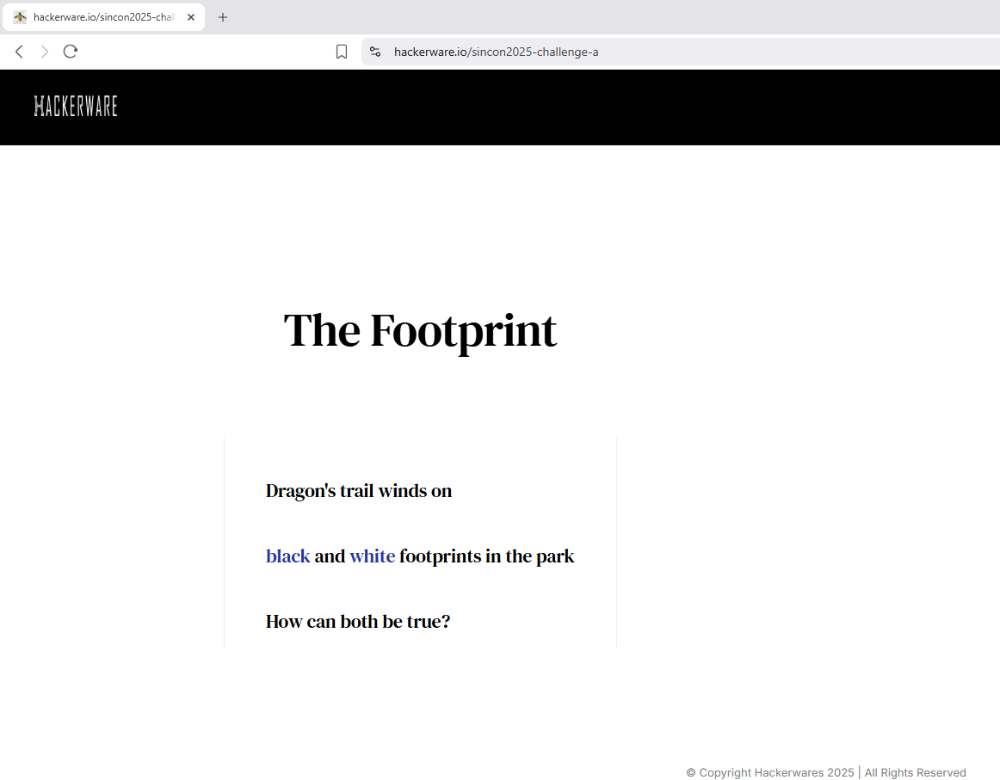

To solve this:

1. **Assemble the QR code** - Combine both pieces
2. **Invert colors** - The second piece needs color inversion (can be done in PowerPoint or image editor)

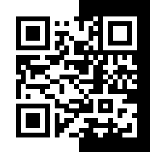

3. **Scan the assembled QR** - This gives us the encoded message:

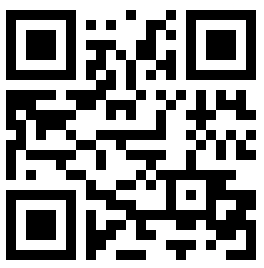

   ```
   jrypbzr gb gur cnex g0n-c4l0u
   ```

Using a cipher identifier, this appears to be ROT13. Decoding it reveals:
```
welcome to the park t0a-p4y0h
```

The flag is: **t0a-p4y0h**

---

### Challenge 4

**Question:**
```
aGFja2Vyd2FyZS5pby9zaW5jb24yMDI1LWdlcmJlci56aXA=
```

**Solution:**

First, decode the Base64 string to reveal a download URL:
```
https://hackerware.io/sincon2025-gerber.zip
```

Download and extract the ZIP file containing Gerber files (PCB design files for the dragon badge). Among the various Gerber files, examine `SINCON-copper3.gbr` which contains the hidden message.

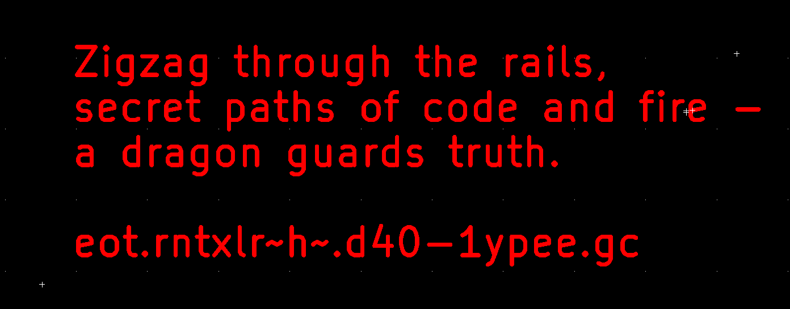

The message indicates to "zigzag through the rails," suggesting this is a Rail Fence cipher. Decoding the ciphertext from the last line using a Rail Fence decoder reveals the hidden message.

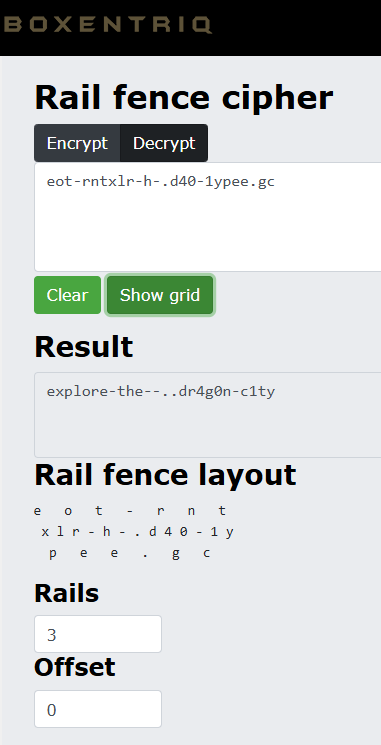

The flag is: **dr4g0n-c1ty**


---

### Challenge 5

**Question:**
```
aGFja2Vyd2FyZS5pby9zaW5jb24yMDI1LWRyYWdvbi1yb2Fy
```

**Solution:**

First, decode the Base64 string to reveal a website URL:
```
https://hackerware.io/sincon2025-dragon-roar
```

Visiting the website shows an audio-related challenge. The audio file can be accessed by appending `.wav` to the URL:
```
https://hackerware.io/sincon2025-dragon-roar.wav
```

Listening to the audio reveals it's a rickroll. The website contains a hint: "if anyone asks: the meme is the secret to the universe!" This suggests using steganography with "rickroll" as the password.

Using steghide to extract hidden data from the audio file with the password `rickroll` reveals a hidden text file `dragonsecret.txt`:

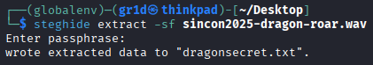

The extracted file contains:

```
The dragon will... bre4th-f1r3
```

The flag is: **bre4th-f1r3**

---

### Challenge 6

**Question:**
```
aGFja2Vyd2FyZS5pby9zaW5jb24yMDI1LWNoYWxsZW5nZS1i
```

**Solution:**

Decoding the Base64 string reveals a URL:
```
https://hackerware.io/sincon2025-challenge-b
```

The website contains another hidden challenge similar to the previous one:

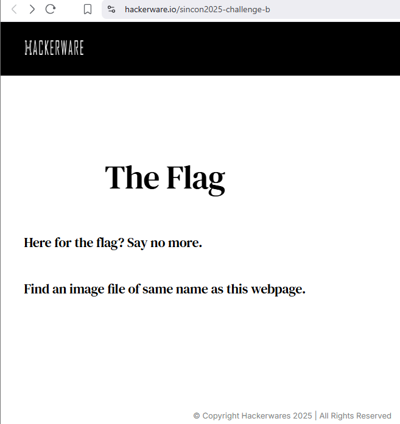

Following the same pattern as Challenge 3, I appended `.png` to the URL to access the challenge image directly:
```
https://hackerware.io/sincon2025-challenge-b.png
```

The image displays a series of semaphore flag positions:

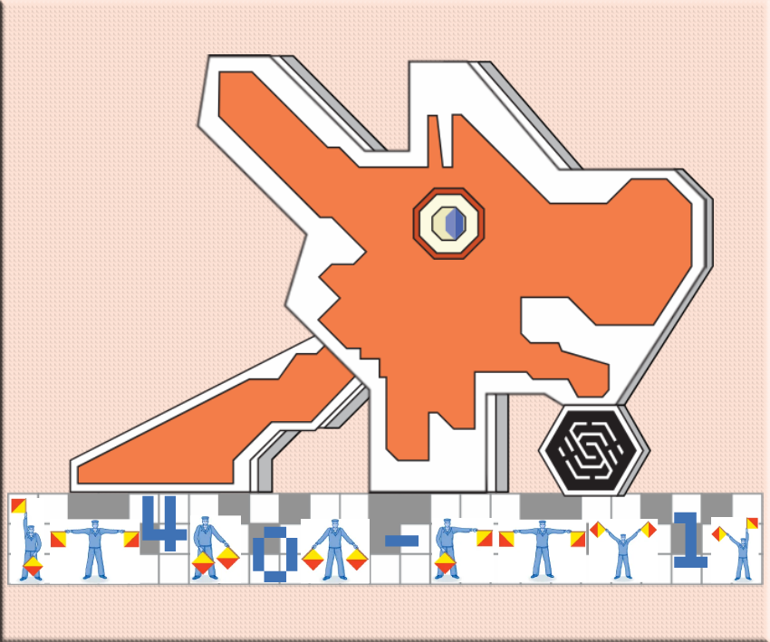

Using a semaphore decoder, each flag position corresponds to a letter:

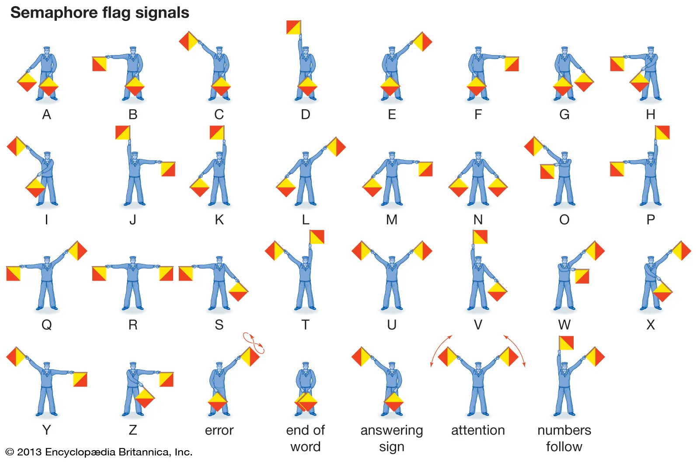

The flag is: **dr4gon-fru1t**

---

### Challenge 7

**Question:**
```
g13 f4 -16 e3 g7 t1 d10 014 419 h2
s9 p17 i8 412 l5 y20 r11 118 a6 n15
```

**Solution:**

This cipher uses character-index pairs where each number represents a positional index. Extract the first character of each pair and sort by their numerical values.

Extracting character-index pairs:
```
g13, f4, -16, e3, g7, t1, d10, 014, 419, h2, s9, p17, i8, 412, l5, y20, r11, 118, a6, n15
```

Sorting by index values (1→20):
```
t1, h2, e3, f4, l5, a6, g7, i8, s9, d10, r11, 412, g13, 014, n15, -16, p17, 118, 419, y20
```

Reading the characters in order: **theflagisdr4g0n-p14y**

The flag is: **dr4g0n-p14y**

---

### Challenge 8

**Question:**
```
aGFja2Vyd2FyZS5pby9zaW5jb24yMDI1LWNoYWxsZW5nZS1j
```

**Solution:**

Decoding the Base64 string reveals another URL:
```
https://hackerware.io/sincon2025-challenge-c
```

Following the established pattern, accessing the challenge image reveals a T9 keypad cipher:

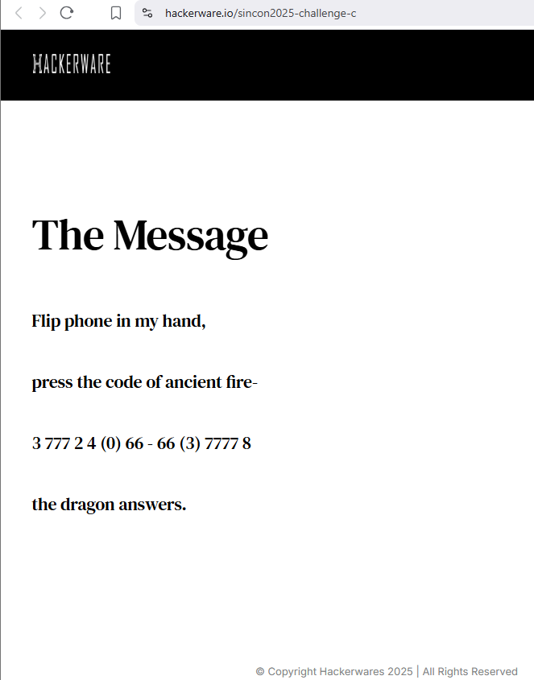

The cipher text is: `3 777 2 4 (0) 66 - 66 (3) 7777 8`

Using T9 keypad decoding (where numbers correspond to multiple key presses):
- 3 = d
- 777 = r  
- 2 = a
- 4 = g
- (0) = 0 (unchanged)
- 66 = n
- \- = - (unchanged)
- 66 = n
- (3) = 3 (unchanged)
- 7777 = s
- 8 = t

The flag is: **drag0n-n3st**

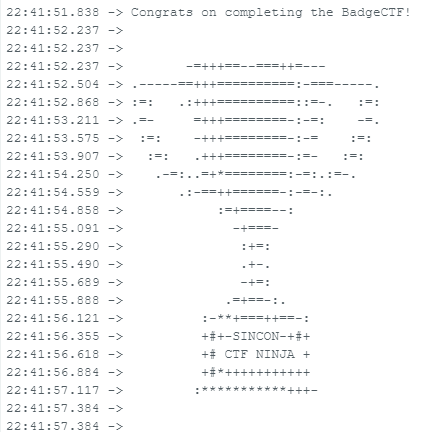

This completes the SinCon 2025 Dragon Badge CTF series - all 8 LEDs on the dragon badge are now successfully lit!