I participated in the SinCon 2025 Hardware Hacking Kampung CTF and tackled challenges across multiple hardware security categories. Here are my writeups for the challenges I solved:

## Challenge Solutions

### 📡 NFC/RFID Exploitation

#### RFID-1

**Challenge Description:**
NFC card cloning challenge that teaches the difference between NFC and RFID technologies. The task involves reading data from one NFC card and writing it to another card.

**Solution:**
This was straightforward to solve using the TagWriter mobile app. The process involved:
1. Reading the original NFC card using a smartphone
2. Writing the cloned data to a blank NFC card
3. Key learning: Mobile phones can handle NFC but not RFID frequencies

---

### ⚡ Side Channel & Fault Injection

#### Fault Injection

**Challenge Description:**
Electromagnetic Fault Injection challenge using the ChipSHOUTER (CW520) platform. This tool injects electromagnetic pulses to disrupt microcontroller operations and potentially bypass security mechanisms.

**Solution:**
We used the ChipSHOUTER to perform privilege escalation on a target microcontroller. The process involved:

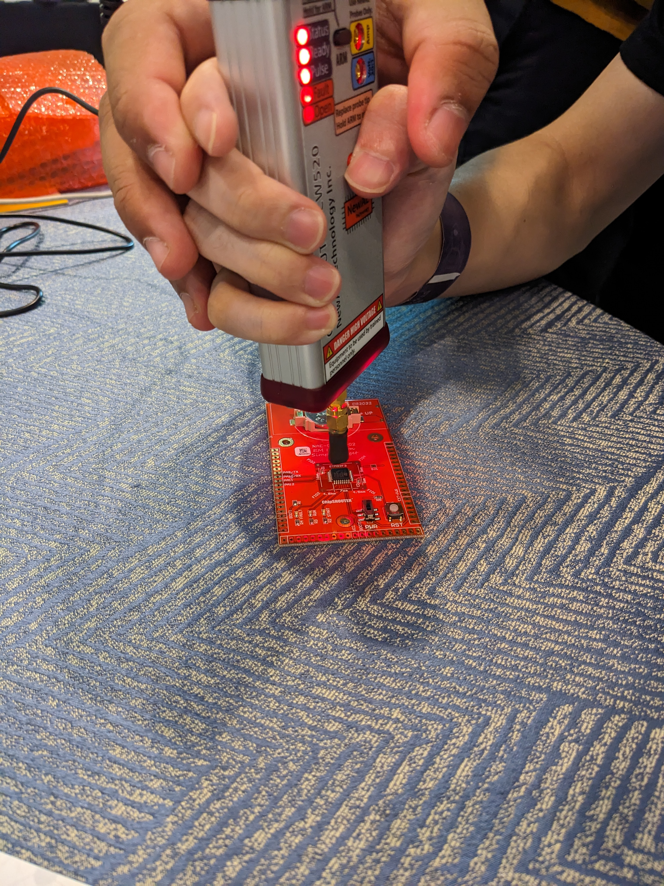

1. **Understanding the mechanism**: Microcontrollers operate with specific voltage thresholds for logic states (0s and 1s)
2. **Applying electromagnetic interference**: The injector sends targeted EM pulses to disrupt normal operation
3. **Finding the sweet spot**: Through trial and error, we located the precise timing and position where the fault injection successfully altered the execution flow
4. **Avoiding false states**: We had to be careful not to crash the system while searching for the correct fault conditions

The challenge was completed when we successfully triggered the fault injection at the right moment to achieve the desired privilege escalation state.

**Flag:** `flag{its_easy_to_fault}`

---

### 🛂 Firmware Extraction & Analysis

#### Reversing Master

**Challenge Description:**
Smart lock firmware reverse engineering challenge that requires privilege escalation through multiple authentication layers. The goal is to analyze a binary to understand its authentication mechanisms and find ways to access hidden debug functionality.

**Solution:**
This challenge involved reverse engineering a smart lock firmware binary to uncover hidden debug functionality and escalate privileges. The key was understanding the authentication flow and memory structure to find the master code and debug commands.

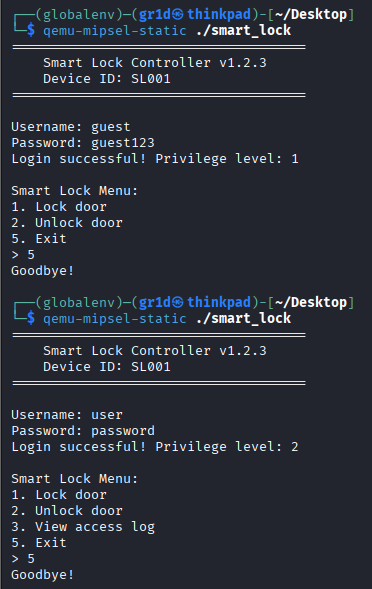
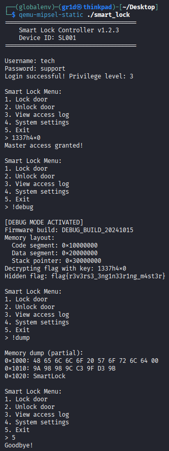

1. **Performed initial file analysis** to understand the binary format:
   - Used `file` command to identify binary type:  
   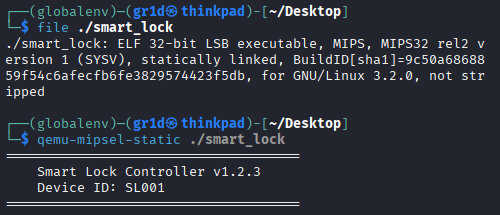
   - Identified as MIPS architecture requiring emulation
   - Set up `qemu-mipsel-static` plugin to emulate the MIPS executable on x86 system

2. **Analyzed the `main` function** to understand program flow:
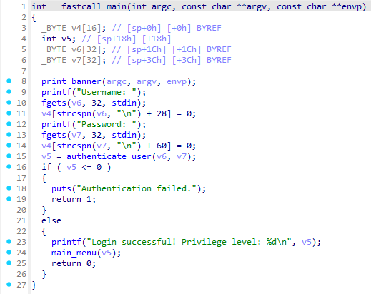  
   - Prompts for username and password with `fgets()`2. **Analyzed the `main` function** to understand program flow:
   - Prompts for username and password with `fgets()`
   - Calls `authenticate_user()` with credentials
   - If authentication succeeds (privilege > 0), enters `main_menu()`

3. **Examined `authenticate_user` function** to understand credential validation:
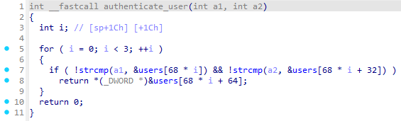
   - Checks credentials against in-memory `users` array with `strcmp()`
   - Each user record is 68 bytes: 32-byte username + 32-byte password + 4-byte privilege
   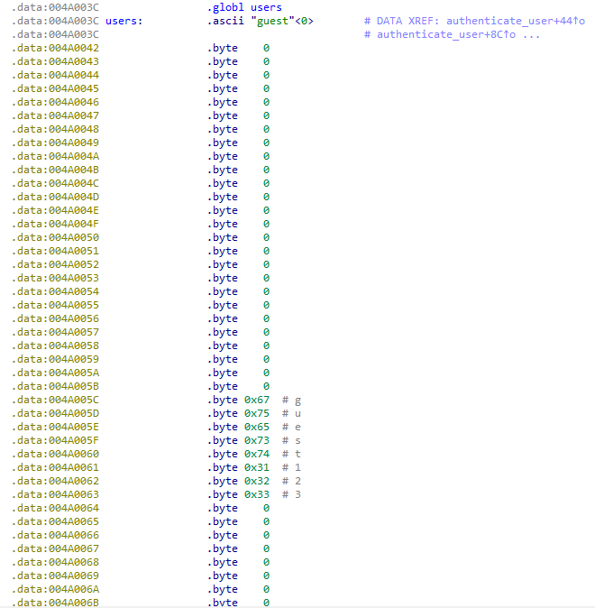  
   - Found valid credentials in the users array:
     - `guest` : `guest123` → privilege level 1
     - `user` : `password` → privilege level 2  
     - `tech` : `support` → privilege level 3

4. **Analyzed `main_menu` function** for privilege escalation:
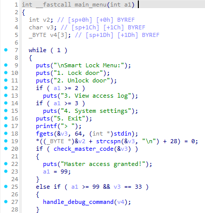  
   - Normal menu provides basic lock operations (Lock/Unlock/View Log/System Settings)
   - Contains hidden master code check: `check_master_code(input)`
   - If master code is correct, elevates privilege to level 99
   - At privilege 99, commands starting with `!` are passed to `handle_debug_command()`

5. **Reverse engineered `check_master_code` function**:
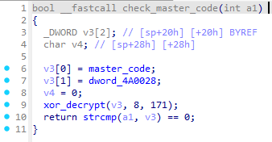  
   - XOR-decrypts two 32-bit values with key `171`(`0xAB`)
   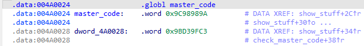  
   - `master_code: 0x9C98989A` and `dword_4A0028: 0x9BD39FC3`
   - Decrypted master code: `1337h4x0`

6. **Discovered `handle_debug_command` functionality**:
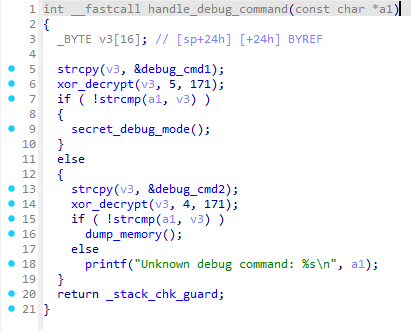  
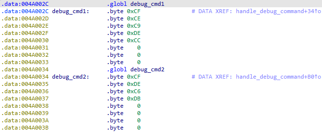  
   - Two encrypted debug commands: `!debug` and `!dump`
   - `!dump` displays memory contents via `dump_memory()`
   - `!debug` calls `secret_debug_mode()` revealing firmware info and the flag

7. **Executed the exploit**:
   - Logged in with `tech:support` to get privilege level 3
   - Entered master code `1337h4x0` to escalate to privilege 99
   - Used `!debug` command to retrieve the flag

**Flag:** `flag{r3v3rs3_3ng1n33r1ng_m4st3r}`

---

### 🔌 Hardware Protocol Analysis

These challenges utilize the CompatrIoT Board to explore various hardware communication protocols and analysis techniques.

#### UART1
**Category:** Hardware Protocol Analysis

**Challenge Description:**
UART (Universal Asynchronous Receiver-Transmitter) communication challenge using the CompatrIoT board. This challenge introduces serial communication protocols and teaches how to establish communication between microcontrollers and host systems.

**Solution:**
This challenge provided an excellent introduction to UART communication and serial terminal tools. The setup involved establishing two separate communication channels with the CompatrIoT board.

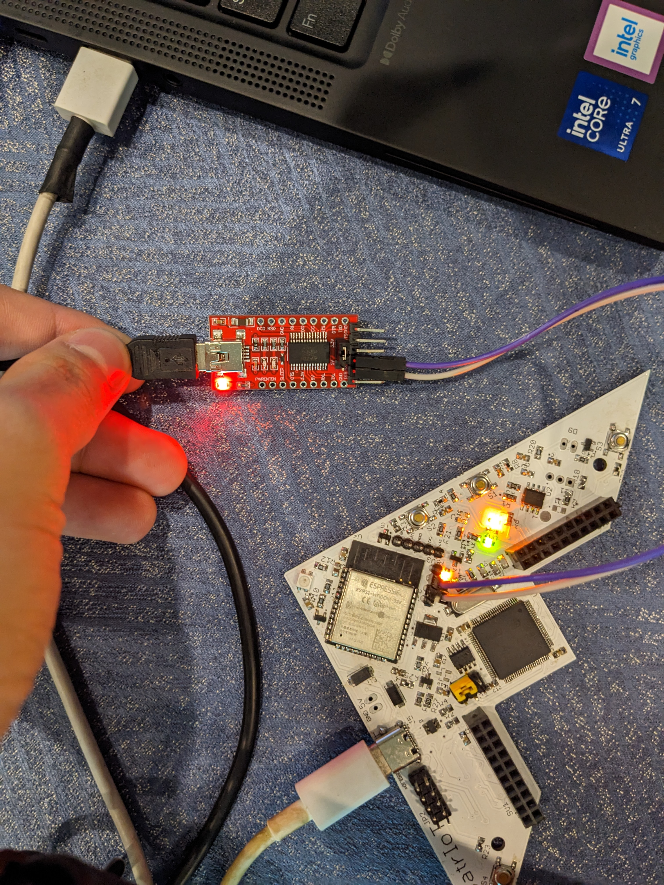

1. **Initial board connection and challenge access**:
   - Connected the CompatrIoT board to laptop via USB-C to USB cable
   - This established the primary communication channel for challenge navigation
   
   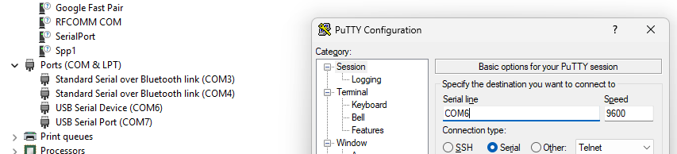
   
   - Accessed the challenge selection interface on the board
   
   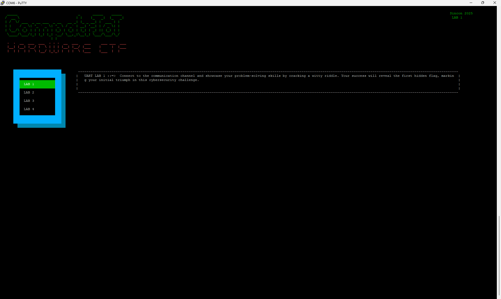
   
   - Selected UART1 challenge by pressing `Enter` to activate it
   
   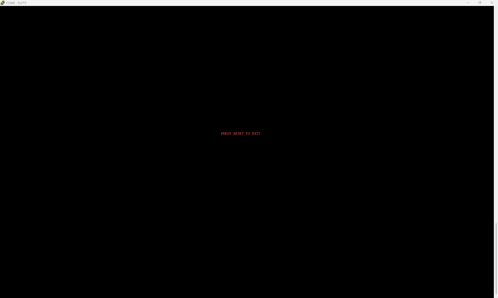

2. **UART communication setup**:
   - **Why FTDI is required**: The FTDI (Future Technology Devices International) chip serves as a USB-to-serial converter. While the CompatrIoT board's USB-C connection provides power and basic communication, the UART challenge requires direct access to the board's TX (transmit) and RX (receive) pins. The FTDI adapter converts these 3.3V/5V serial signals to USB, allowing the laptop to communicate with the UART interface.
   
   - Connected UART pins with crossover wiring:
     - Board TX → FTDI RX  
     - Board RX → FTDI TX
     - This crossover connection ensures proper bidirectional communication
   
   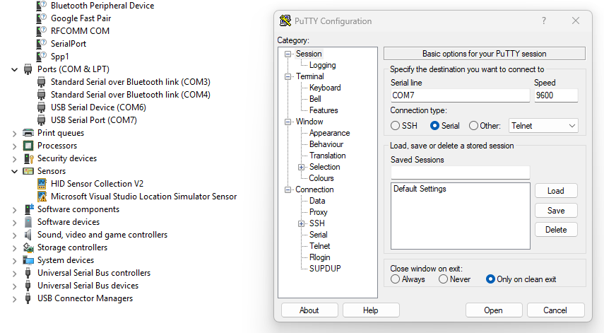

3. **Serial communication with PuTTY**:
   - Used PuTTY terminal emulator for serial communication
   - Configuration settings:
     - Connection type: Serial
     - Baud rate: 9600 (standard default for UART communication)
     - COM port: COM7 (as detected in Windows Device Manager)
   
   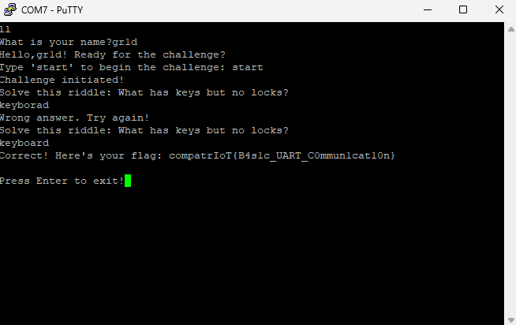

4. **Challenge completion**:
   - The challenge presented a simple riddle
   - Answer: `keyboard`
   - Successfully retrieved the flag upon correct answer

**Flag:** `compatrIoT{B4s1c_UART_C0mmun1cat10n}`

---

#### UART2

**Challenge Description:**
UART communication challenge requiring baud rate discovery and mathematical problem solving.

**Solution:**
This challenge required finding the correct baud rate to establish communication, then solving a numerical puzzle.

1. **Baud rate discovery**:
   - Tested standard baud rates systematically
   
   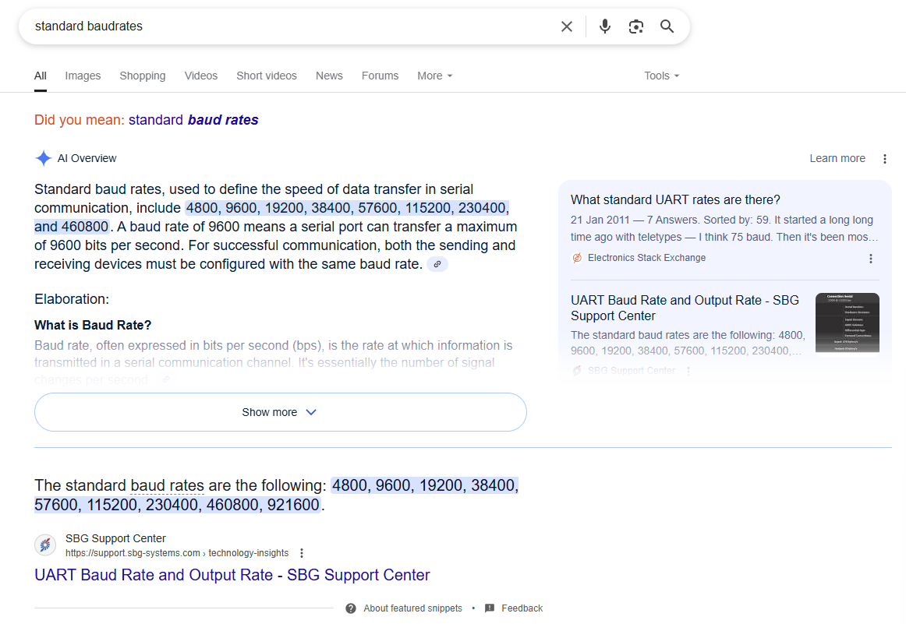
   
   - Found correct baud rate: **57600**
   
   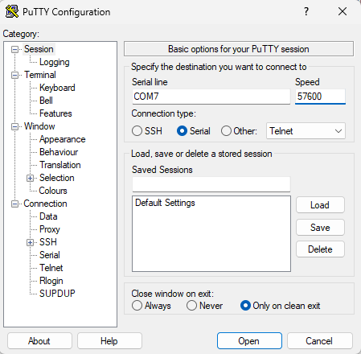

2. **Mathematical puzzle**:
   - Challenge presented a numerical calculation
   
   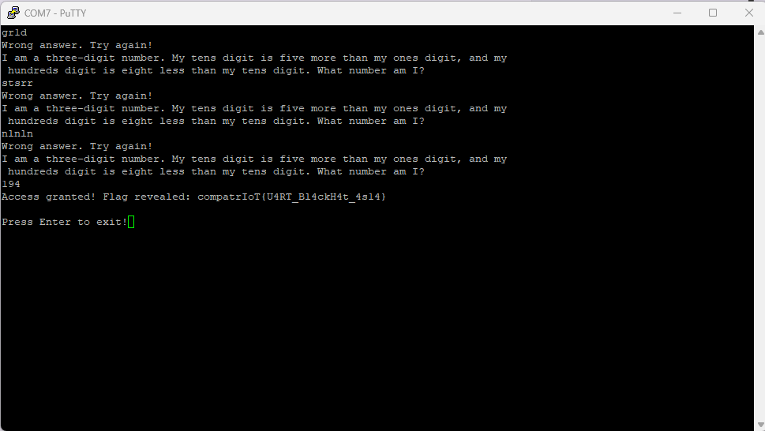
   
   - Answer: `194`

**Flag:** `compatrIoT{U4RT_Bl4ckH4t_4s14}`

#### Logic Analyser 1

**Challenge Description:**
Logic analyzer challenge requiring custom baud rate determination using signal analysis.

**Solution:**
Used Saleae Logic Analyzer to determine non-standard baud rate through timing analysis.

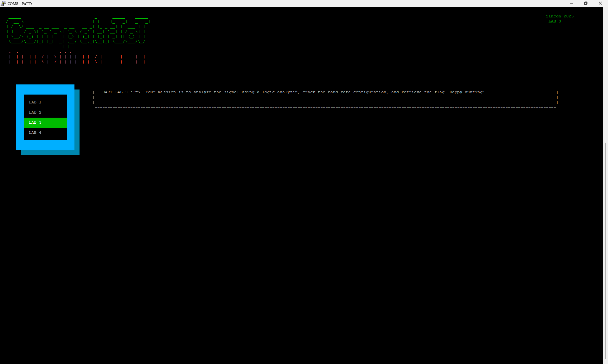

1. **Signal capture**:
   - Connected TX and GND to logic analyzer
   
   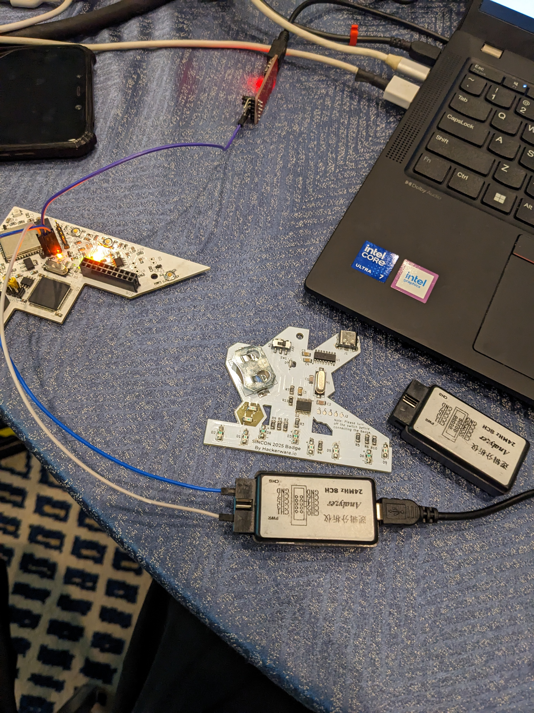
   
   - Captured UART transmission in Saleae Logic software
   
   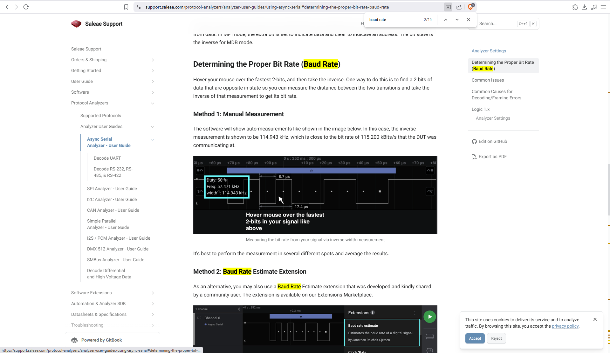

2. **Baud rate calculation**:
   - Used fastest 2-bit method: measure time between opposite bits (1→0)
   - Applied formula: Baud rate = 1 / bit time
   - Result: **4000 baud**
   
   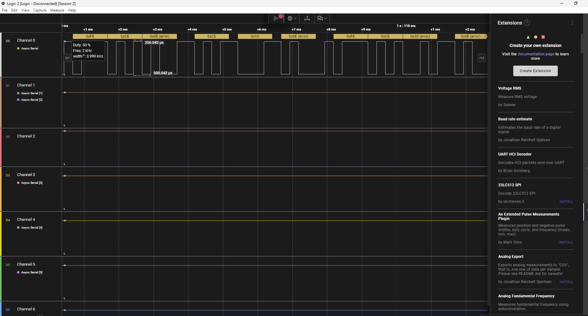
   
   *Reference: [Saleae Logic Documentation](https://support.saleae.com/protocol-analyzers/analyzer-user-guides/using-async-serial#determining-the-proper-bit-rate-baud-rate)*

3. **Challenge completion**:
   - Connected with PuTTY using baud rate 4000
   
   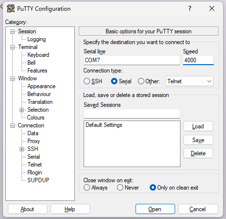
   
   - Flag provided immediately upon connection
   
   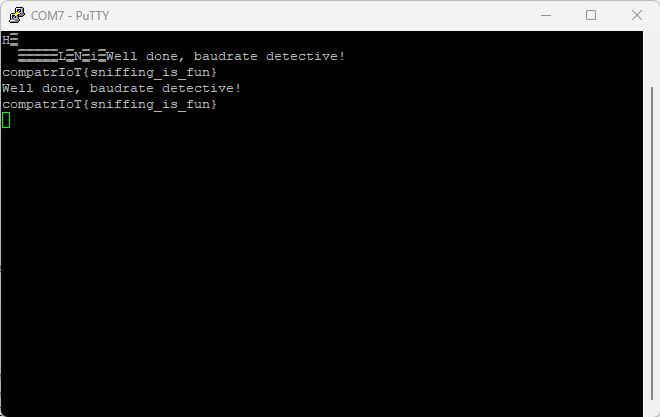

**Flag:** `compatrIoT{sniffing_is_fun}`

#### Logic Analyser 2

**Challenge Description:**
I2C protocol analysis challenge requiring password extraction through EEPROM signal monitoring using logic analyzer.

**Solution:**
Used Saleae Logic Analyzer to monitor I2C communication and extract password from EEPROM reads during authentication.

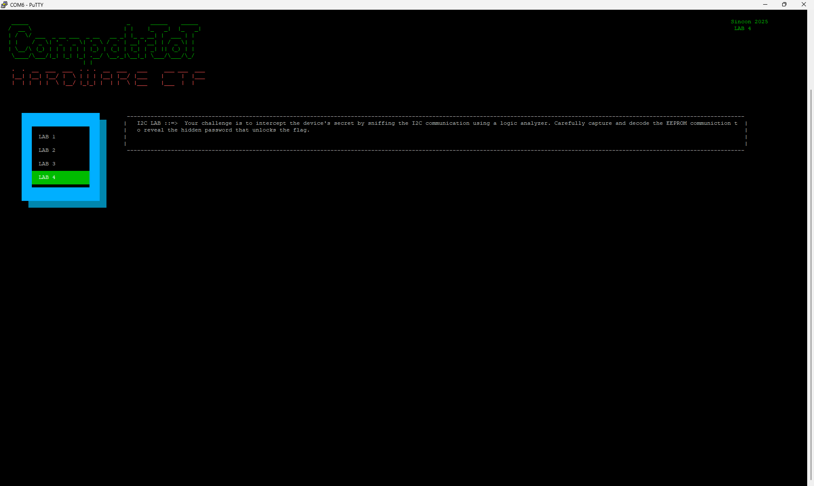

1. **I2C connection setup**:
   - Connected SDA, SCL, and GND pins to logic analyzer based on provided schematic
   
   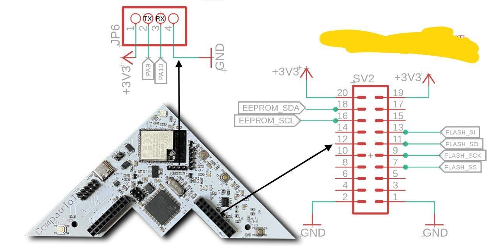

2. **Signal monitoring**:
   - Accessed challenge login page requiring password input
   - Entered random input to trigger authentication process
   
   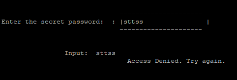
   
   - Observed I2C signal activity in Saleae Logic during authentication
   
   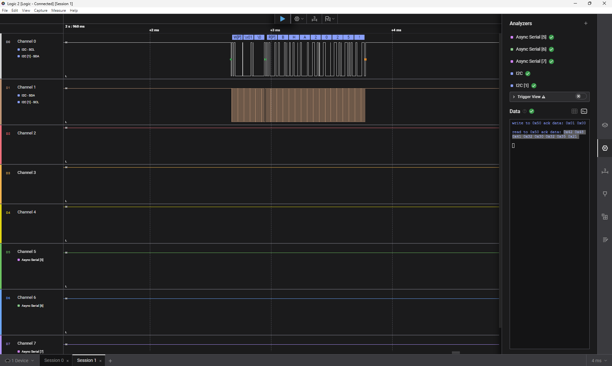

3. **Password extraction**:
   - Analyzed I2C communication to extract comparison string
   - Identified password: `BHA2025!`
   - Successfully authenticated with extracted password
   
   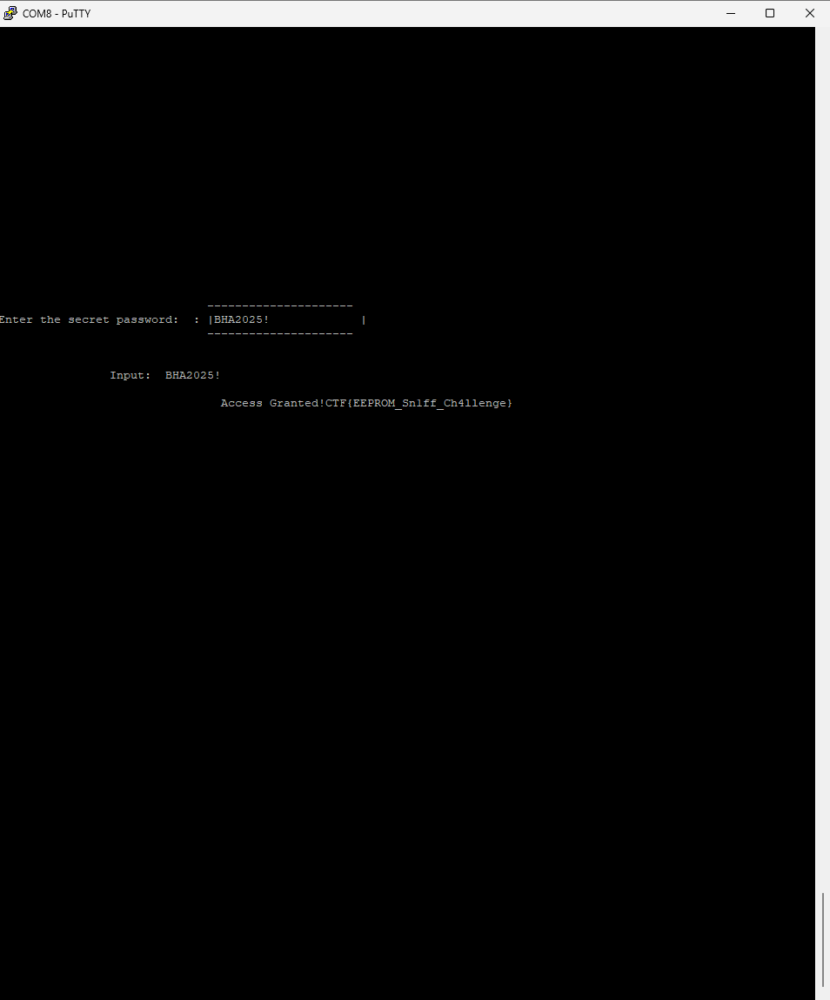

**Flag:** `CTF{EEPROM_Sn1ff_Ch4llenge}`

---

## Challenges Not Attempted

### 📶 BLE (Bluetooth Low Energy)

#### BLE-Device 1

**Challenge Description:**
Introduction to Bluetooth Low Energy (BLE) hacking using mobile analysis tools.

**Solution:**
I didn't fully attempt this challenge. Started exploring with nRF Connect mobile app but didn't complete the challenge requirements.

---

### 🔧 Soldering & PCB Reversing

#### Solder Says

**Challenge Description:**
Basic soldering challenge on the SinCon badge (SGD 40). Requires soldering through-hole LEDs.

**Solution:**
I didn't attempt this challenge as it required purchasing the SGD 40 badge. The challenge would involve soldering the provided LEDs into the designated through-hole positions on the badge.

---

### 📡 RFID

#### RFID-2

**Challenge Description:**
Advanced RFID challenge requiring specialized hardware to read RFID card information using tools like Proxmark3.

**Solution:**
I didn't attempt this challenge due to time constraints. The solution would involve using an RFID card reader and working with Proxmark3 to extract information from the RFID card.

---

### 📻 Wireless Protocol Exploitation

#### BPSK Challenge

**Challenge Description:**
Wireless protocol exploitation challenge involving Binary Phase Shift Keying (BPSK) modulated signals. Requires analyzing and exploiting wireless communication protocols to extract hidden information or gain unauthorized access.

**Solution:**
I didn't attempt this challenge due to unfamiliarity with wireless protocol exploitation and BPSK demodulation techniques.

#### Pager Challenge

**Challenge Description:**
Wireless protocol exploitation challenge focusing on pager communication systems. Involves intercepting, analyzing, and potentially manipulating pager protocol communications.

**Solution:**
I didn't attempt this challenge due to unfamiliarity with pager protocol exploitation techniques.