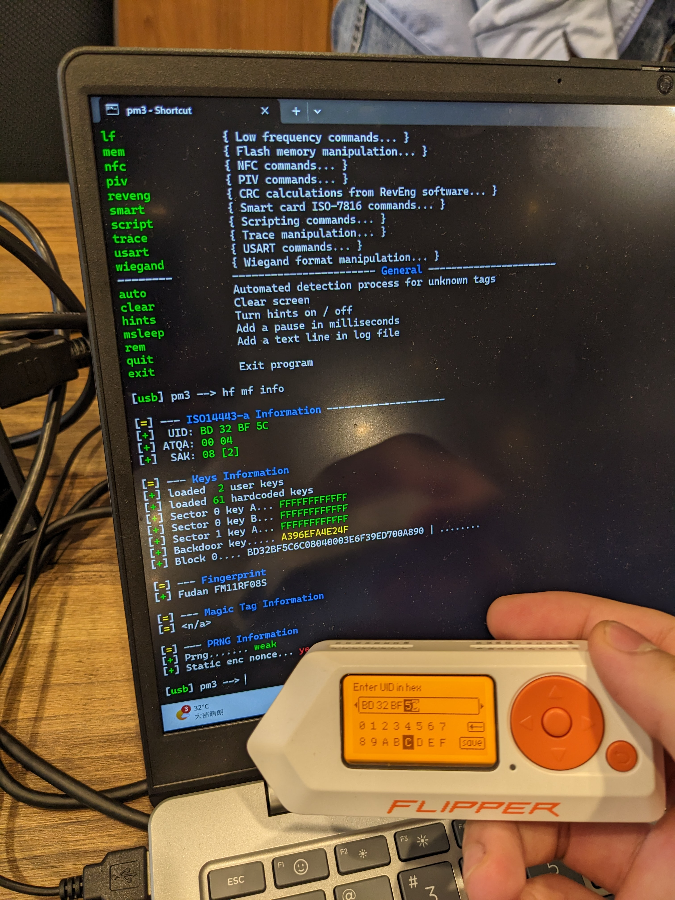
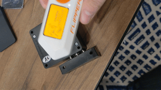
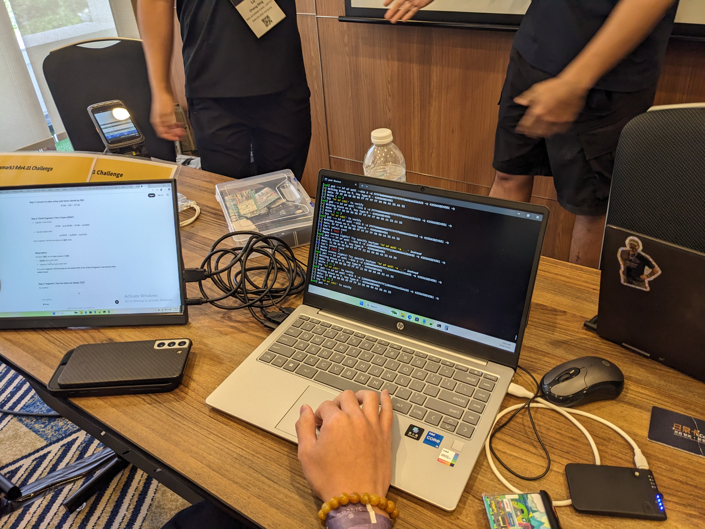
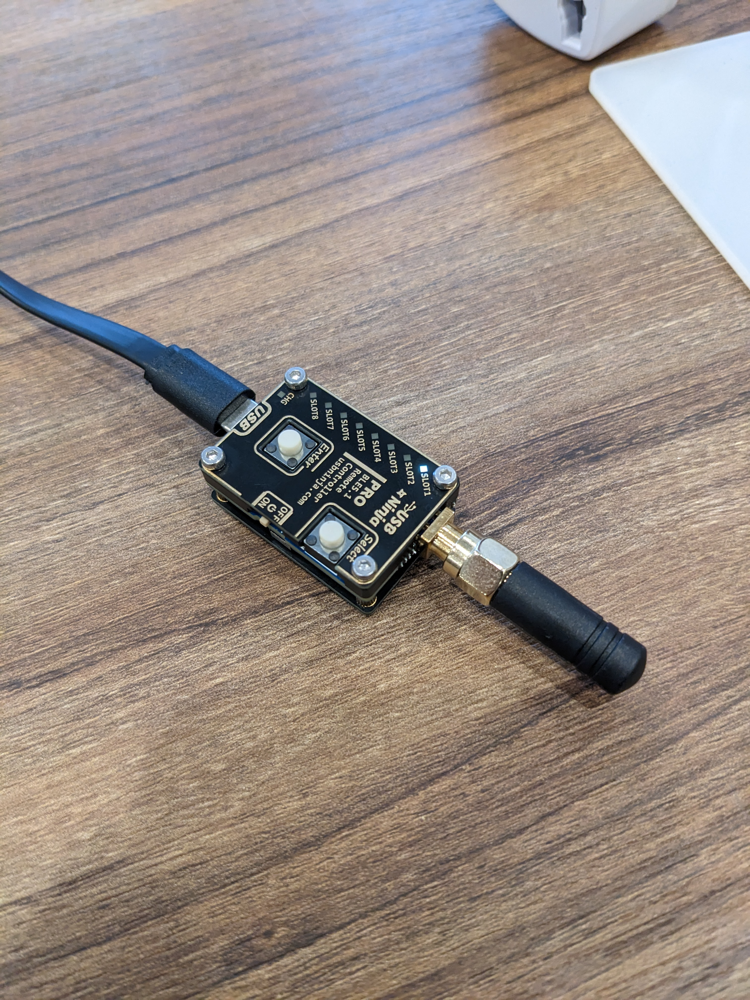
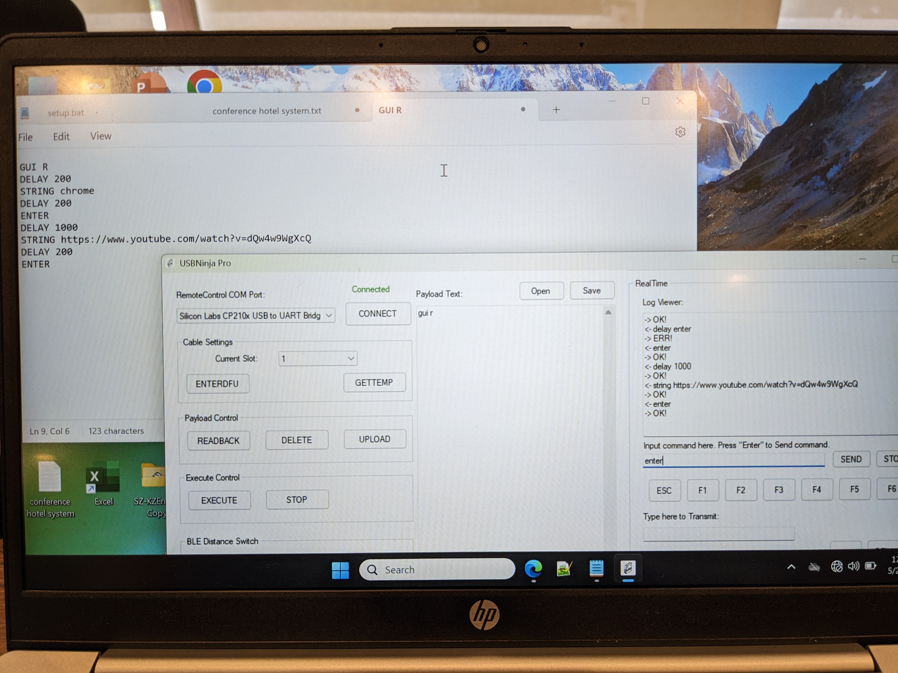
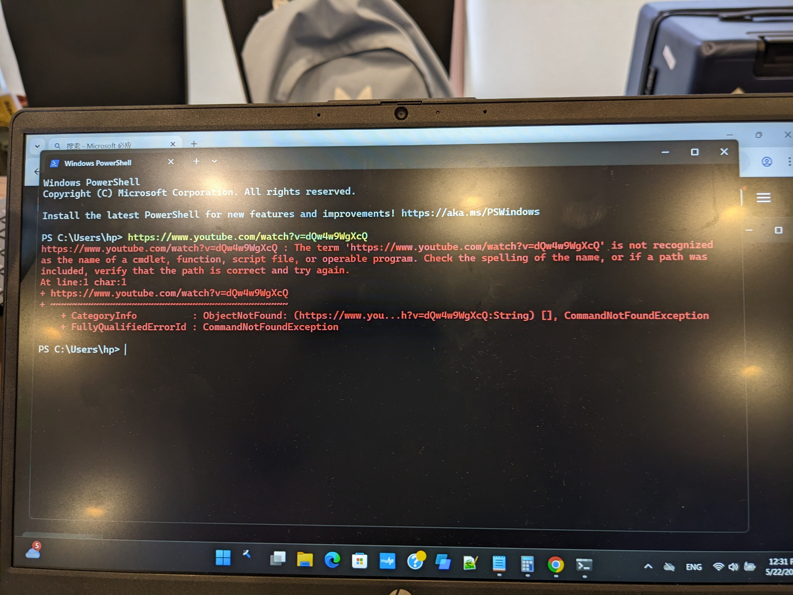

The RFID Research Kampung at SINCON 2025 was a hands-on workshop where we could explore various RFID security tools and learn about real-world attack scenarios. Here's what went down during the session.

  
*The RFID Research Kampung setup at SINCON 2025*

## RFID Tools Available

The kampung featured several professional RFID security tools:

- **Proxmark3** — A powerful RFID tool for reading, cloning, and emulating access cards
- **Flipper Zero** — A multi-functional pentesting device for NFC, RFID, and wireless systems
- **ChameleonUltra** — An advanced RFID card emulation and cloning device
- **RFID Detectors** — Including the Proxgrind signal sniffer for real-time RFID signal analysis

## RFID Card Cloning Demonstration

### Basic RFID Attack Workflow

The first demonstration covered a straightforward RFID attack process:

1. **Reading the UID**: Using Proxmark3 CLI to extract the card's UID
2. **Cloning with Flipper Zero**: Copying the UID and configuring the Flipper Zero to emulate the original card
3. **Testing**: Attempting to unlock an RFID-protected lock with the emulated card

  
*Reading RFID card UID using Proxmark3*

  
*Successfully unlocking RFID lock with Flipper Zero as cloned card medium*

### Touch 'n Go Card Analysis

We also observed participants working with Touch 'n Go RFID cards (SMART Tag MaxTag), demonstrating how Proxmark3 can analyze and potentially modify the stored balance on these contactless payment cards.

  
*Touch 'n Go RFID card analysis session*

## BadMouse Demonstration

### Hardware Modification Process

The BadMouse demonstration showed how everyday USB devices can be weaponized. The process involved:

1. **Installing USB Ninja Module**: The module acts as a wireless receiver inside the mouse
2. **Wireless Control Setup**: A separate transmitter device enables remote control of the compromised mouse

  
*USB Ninja module installed as receiver in the mouse*

  
*Wireless transmitter device for remote control*

### Attack Execution Methods

The attack can be executed in two different modes:

- **Live Attack Mode**: Real-time command execution
- **Scripted Attack Mode**: Pre-programmed payload execution for more complex attacks

  
*Attacker interface showing command queuing and execution options*

The demonstration showed how an attacker can remotely execute commands on a victim's machine through what appears to be an ordinary mouse.

  
*Victim machine being controlled through the BadMouse attack*

## Key Observations

- **RFID systems are vulnerable** — Simple UID-based authentication can be easily cloned
- **Physical access = game over** — Direct device access enables sophisticated attacks
- **Trust your hardware sources** — Common USB devices can be weaponized with minimal effort