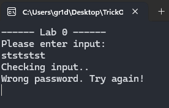
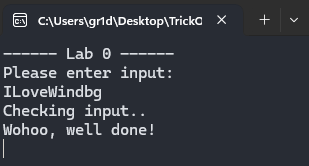
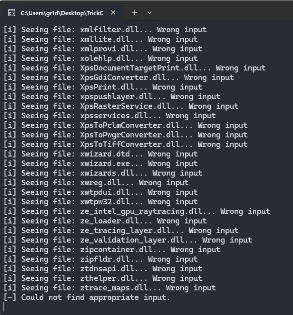
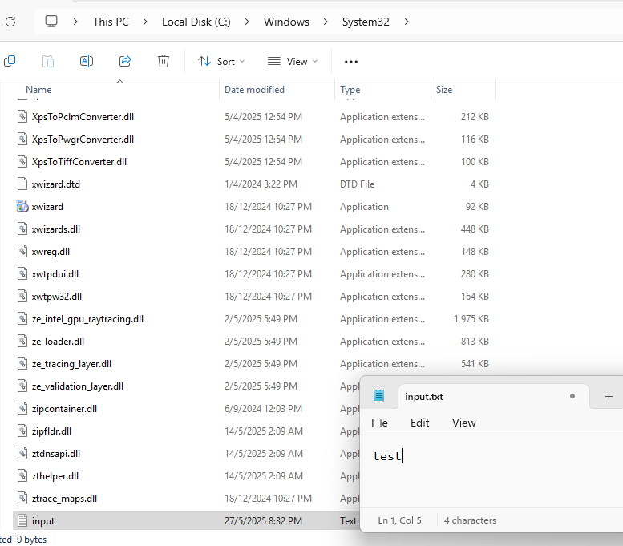
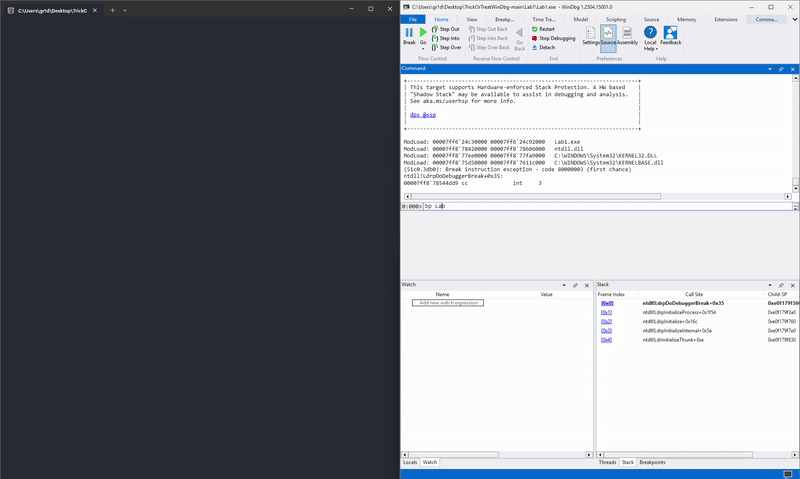
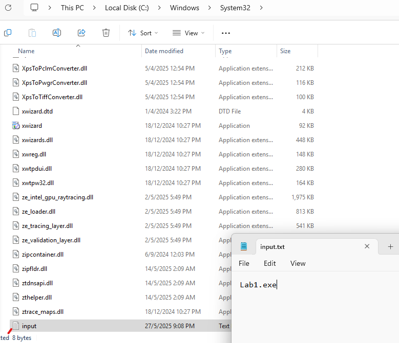
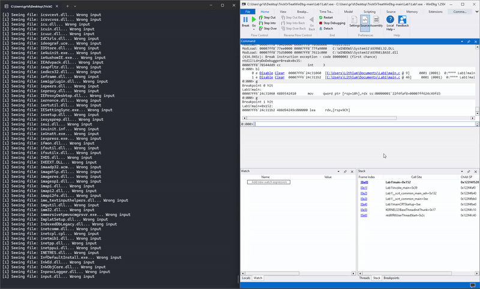

I attended an insightful WinDbg workshop at SinCon 2025. This writeup covers the key concepts, tools, and techniques discussed during the session, including practical examples and my key takeaways.


## Key Concepts Covered

The workshop covered fundamental **WinDbg navigation** and **dynamic analysis techniques**. A key focus was the **x64 calling convention**, which dictates how arguments are passed to functions and how return values are handled. This convention is similar to **Linux syscalls**, but with a different register order for arguments, starting with **RCX** instead of **RDI**.

**x64 Calling Convention Summary:**

*   **Return value:** `rax`
*   **1st argument:** `rcx`
*   **2nd argument:** `rdx`
*   **3rd argument:** `r8`
*   **4th argument:** `r9`
*   **5th argument:** `rsp + 0x28`
*   **6th argument:** `rsp + 0x30` (rsp + 0x28 + 4)

Additionally, the workshop covered practical skills such as **setting breakpoints** at the main entry point and other decision points within the code. We learned to **inspect register contents** to understand the arguments passed to key functions and to **analyze memory dumps** to identify the information required to satisfy program checks

---

#### Setting up breakpoints

| Command          | Use                                                     |
| ---------------- | ------------------------------------------------------- |
| `bp XX`          | Set a breakpoint at XX                                  |
| `bp $entry`      | Set a breakpoint at the entry point                     |
| `bl`             | List breakpoints                                        |
| `bc X \| bd X` | Clear \\| disable breakpoint index X                     |
| `? module!func*` | Check if the address of a target function is “resolved” |
| `lm`             | List Modules (shows loaded modules’ info)               |

---

#### Executing through

| Command      | Use                                 |
| ------------ | ----------------------------------- |
| `k`          | Display the function call stack     |
| `p`          | Step over the next instruction      |
| `pc \| pt` | Step until next call \\| next return |
| `t`          | Step into the next instruction      |
| `g`          | Go: execute until a breakpoint/stop |

---

#### Interacting with registers

| Command        | Use                                                   |
| -------------- | ----------------------------------------------------- |
| `r`            | “Display registers”: shows content of major registers |
| `? XX`         | “Show what X contains”                                |
| `d(b\|w\|d\|q)` | Display X as byte\\|word\\|dword\\|qword                 |

---

### Advanced Techniques

*(e.g., Scripting, extensions, memory analysis, crash dump analysis)*

## Practical Exercises

### Lab0

First, I examined the program's behavior by running it:



It ask the user to enter an input and check if it is true, else, showing wrong password,

So, I use windbg

```
0:000> bp Lab0!main
breakpoint 0 redefined
0:000> g
Breakpoint 0 hit
Lab0!main:
00007ff6`d5931120 4889542410      mov     qword ptr [rsp+10h],rdx ss:000000f2`c54ffa38=00007ff6d59315c9
0:000> pc
Lab0!main+0x31:
00007ff6`d5931151 e86a000000      call    Lab0!printf (00007ff6`d59311c0)
0:000> pc
Lab0!main+0x3d:
00007ff6`d593115d e85e000000      call    Lab0!printf (00007ff6`d59311c0)
0:000> pc
Lab0!main+0x54:
00007ff6`d5931174 e8c7000000      call    Lab0!wscanf_s (00007ff6`d5931240)
0:000> pc
Lab0!main+0x62:
00007ff6`d5931182 e879feffff      call    Lab0!VerifyInput (00007ff6`d5931000)
0:000> t
Lab0!VerifyInput:
00007ff6`d5931000 48894c2408      mov     qword ptr [rsp+8],rcx ss:000000f2`c54ff7e0={Lab0!_NULL_IMPORT_DESCRIPTOR <PERF> (Lab0+0x29098) (00007ff6`d5959098)}
0:000> t
Lab0!VerifyInput+0x9:
00007ff6`d5931009 488d0df07f0200  lea     rcx,[Lab0!_NULL_IMPORT_DESCRIPTOR <PERF> (Lab0+0x29000) (00007ff6`d5959000)]
0:000> t
Lab0!printf:
00007ff6`d59311c0 48894c2408      mov     qword ptr [rsp+8],rcx ss:000000f2`c54ff7a0=0000000000000000
0:000> db rcx
00007ff6`d5959000  43 68 65 63 6b 69 6e 67-20 69 6e 70 75 74 2e 2e  Checking input..
00007ff6`d5959010  0a 00 00 00 00 00 00 00-49 00 4c 00 6f 00 76 00 65 00 57 00 69 00 6e 00 64 00 62 00 67 00 00 00  e.W.i.n.d.b.g...
00007ff6`d5959030  57 6f 68 6f 6f 2c 20 77-65 6c 6c 20 64 6f 6e 65  Wohoo, well done
00007ff6`d5959040  21 0a 00 00 00 00 00 00-57 72 6f 6e 67 20 70 61 73 73 77 6f 72 64 2e 20 54 72 79 20 61 67 61 69  ssword. Try agai
00007ff6`d5959060  6e 21 0a 00 00 00 00 00-2d 2d 2d 2d 2d 2d 20 4c 61 62 20 30 20 2d 2d 2d 2d 2d 2d 0a 00 00 00  lab 0 ------.....
0:000> g
ModLoad: 00007ff8`74370000 00007ff8`7438a000   C:\WINDOWS\SYSTEM32\kernel.appcore.dll
ModLoad: 00007ff8`77880000 00007ff8`77929000   C:\WINDOWS\System32\msvcrt.dll
ntdll!NtTerminateProcess+0x14:
00007ff8`785824f4 c3              ret
```
My approach was to first set a breakpoint at the `main` function. Then, I used the `pc` (step to next call) command repeatedly to navigate through the execution flow until I reached the `VerifyInput` function. 

At this point, I switched to the `t` (trace into) command to step into `VerifyInput`. I continued stepping until I observed the `rcx` register being used to pass an argument. Dumping the memory pointed to by `rcx` revealed that the program expected the input to be `ILoveWindbg` to pass the check.

After discovering the required input, I reran the program. This time, with the correct input, the program successfully passed the check and displayed a "well done" message, as shown below:



### Lab 1

First, I examined the initial behavior of the Lab 1 program:



The program appeared to be searching for a specific file within the `C:\\Windows\\System32` directory and exiting if not found.

Next, I used WinDbg to investigate which file it was looking for and what its requirements were.

```
0:000> bp Lab1!main
breakpoint 0 redefined
0:000> g
Breakpoint 0 hit
Lab1!main:
00007ff6`24c31060 4889542410      mov     qword ptr [rsp+10h],rdx ss:0000006f`da11f758=00007ff624c49fd3
0:000> pc
Lab1!main+0x8b:
00007ff6`24c310eb ff150f2f0400    call    qword ptr [Lab1!_imp_GetCurrentDirectoryA (00007ff6`24c74000)] ds:00007ff6`24c74000={KERNEL32!GetCurrentDirectoryAStub (00007ff8`77f25ed0)}
0:000> pc
Lab1!main+0xd0:
00007ff6`24c31130 e88b670100      call    Lab1!strcpy_s (00007ff6`24c478c0)
0:000> pc
Lab1!main+0xe9:
00007ff6`24c31149 e8126e0100      call    Lab1!strcat_s (00007ff6`24c47f60)
0:000> pc
Lab1!main+0xfb:
00007ff6`24c3115b ff15af2e0400    call    qword ptr [Lab1!_imp_FindFirstFileA (00007ff6`24c74010)] ds:00007ff6`24c74010={KERNEL32!FindFirstFileA (00007ff8`77f37330)}
0:000> pc
Lab1!main+0x1bb:
00007ff6`24c3121b ff15f72d0400    call    qword ptr [Lab1!_imp_FindNextFileA (00007ff6`24c74018)] ds:00007ff6`24c74018={KERNEL32!FindNextFileA (00007ff8`77f373a0)}
0:000> pc
Lab1!main+0x149:
00007ff6`24c311a9 e8f26d0100      call    Lab1!strcmp (00007ff6`24c47fa0)
0:000> t
Lab1!strcmp:
00007ff6`24c47fa0 482bd1          sub     rdx,rcx
0:000> db rcx
0000006f`da11f21c  30 61 65 33 62 39 39 38-2d 39 61 33 38 2d 34 62  0ae3b998-9a38-4b
0000006f`da11f22c  37 32 2d 61 34 63 34 2d-30 36 38 34 39 34 34 31  72-a4c4-06849441
0000006f`da11f23c  35 31 38 64 5f 53 65 72-76 69 63 69 6e 67 2d 53  518d_Servicing-S
0000006f`da11f24c  74 61 63 6b 2e 64 6c 6c-00 01 00 00 c7 00 00 00  tack.dll........
0000006f`da11f25c  00 00 00 00 00 00 00 00-00 00 00 00 f1 6c 43 78  .............lCx
0000006f`da11f26c  f8 7f 00 00 00 00 00 00-00 00 00 00 00 00 00 00  ................
0000006f`da11f27c  f6 7f 00 00 00 00 00 00-00 00 00 00 60 00 2c 40  ............`.,@
0000006f`da11f28c  00 00 00 00 00 00 00 00-00 00 00 00 80 04 00 00  ................
0:000> db rdx
00007ff6`24c89050  69 6e 70 75 74 2e 74 78-74 00 00 00 00 00 00 00  input.txt.......
00007ff6`24c89060  5b 2b 5d 20 53 65 65 69-6e 67 20 66 69 6c 65 3a  [+] Seeing file:
00007ff6`24c89070  20 25 73 2e 2e 2e 20 46-6f 75 6e 64 20 66 69 6c   %s... Found fil
00007ff6`24c89080  65 2c 20 63 68 65 63 6b-69 6e 67 20 63 6f 6e 74  e, checking cont
00007ff6`24c89090  65 6e 74 0a 00 00 00 00-5b 69 5d 20 53 65 65 69  ent.....[i] Seei
00007ff6`24c890a0  6e 67 20 66 69 6c 65 3a-20 25 73 2e 2e 2e 20 57  ng file: %s... W
00007ff6`24c890b0  72 6f 6e 67 20 69 6e 70-75 74 0a 00 00 00 00 00  rong input......
00007ff6`24c890c0  5b 2d 5d 20 43 6f 75 6c-64 20 6e 6f 74 20 66 69  [-] Could not fi
```

My debugging process started by setting a **breakpoint** at the `main` function (`bp Lab1!main`). I then used the **`pc`** (step to next call) command to iterate through the execution. This continued until I encountered a call to **`strcmp`**. Using the **`t`** (trace into) command, I stepped into **`strcmp`** and examined the arguments passed in **`rcx`** and **`rdx`**. This revealed that the program was checking for the existence of `input.txt` in the `C:\\Windows\\System32` directory.

To observe the program's behavior with the file present, I created `input.txt` in the `C:\\Windows\\System32` directory and initially filled it with the string "test" for further analysis:





Upon re-examining the program's behavior with `input.txt` present, I again set a **breakpoint** at `main` and used **`pc`** to step through. I noticed the program seemed to loop when checking for `input.txt`. To understand why, I used the **`u`** (unassemble) command to inspect the assembly code and found a **`jne`** (jump if not equal) instruction causing the loop.

To bypass this loop and proceed to the next stage, I set a new **breakpoint (`bp`)** at the address immediately following the **`jne`** instruction. Using the **`g`** (go) command, I ran the program until this new breakpoint was hit, successfully moving past the file existence check.

Continuing with **`pc`**, I eventually encountered another **`strcmp`** call. This time, it was checking the *content* of `input.txt`. I used **`t`** to trace into this **`strcmp`** and then **`db`** to dump the contents of **`rcx`** and **`rdx`**. This revealed that the program expected the content of `input.txt` to be "**Lab1.exe**". My placeholder "test" string was visible in **`rdx`**, confirming the check.

Knowing the required content, I modified `input.txt` to contain "**Lab1.exe**":



After rerunning the dynamic analysis with the corrected `input.txt`, the program successfully passed all checks and displayed a "good input!" message:



### Visualizing Execution Flow with DrawMeATree

[View the DrawMeATree GitHub repository](https://github.com/CrowdStrike/drawmeatree)

One particularly interesting tool introduced was **DrawMeATree**. This Python tool converts the output of WinDbg's `wt` (Watch Trace) command into customizable graphical trees. This can be incredibly helpful for:

*   Identifying components, functionalities, and the overall operation of a program.
*   Highlighting connections between functions and modules.
*   Summarizing large and complex amounts of information using custom filters.

**DrawMeATree Filtering Methodology:**

1.  Generate `wt` output into a log file.
2.  Identify the maximum depth required for filtering (or regenerate from a function of interest if the trace is too large).
3.  Remove irrelevant "high-level" nodes that would clear entire branches (e.g., allocation/freeing phases, default routines, string handling).
4.  Remove nodes/modules that do not help answer your initial debugging question.

A general debugging methodology incorporating DrawMeATree could be:

1.  Start debugging at a chosen point (e.g., `bp $exentry`, `bp module!FunctionX`).
2.  If you don't have a specific target, use `wt` and then **DrawMeATree** to get a better overview of the execution flow.
3.  Get as close as possible to your target and observe its behavior.

## Conclusion & Takeaways

This WinDbg workshop provided valuable insights into **dynamic analysis on Windows** and the practical application of **WinDbg** for **reverse engineering**. The hands-on labs effectively demonstrated the **x64 calling convention**, **memory inspection techniques**, and **breakpoint usage**. The introduction to **DrawMeATree** also highlighted a method for visualizing program execution flow.

Key takeaways:

*   Essential **WinDbg commands** for debugging.
*   A clearer understanding of the **x64 calling convention** and its importance in analyzing function arguments and return values.
*   Systematic **debugging methodology**: observe, hypothesize, test, and iterate.
